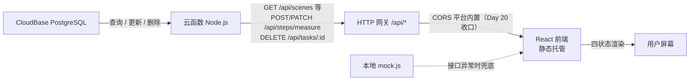

# 《电子设备使用指南》接口契约（api-contract）

> **v1.9 ｜ Day 26** ｜ 2026-10-10 ｜ Vibe Coding 五步工作流 · 第 4 周第 5 天（**订正 §4.6 一处 `error` 标识误记：`bad_task_id` → `invalid_param`；接口代码零变更**）
>
> **本文档的依据**：`PRD.md` **v2.4** 第 6 节「数据字段」与第 7 节「暂不做清单」第 218 行补注（Day 18 晚开 `POST` 例外 → **Day 22 再开 `PATCH` / `DELETE` 两个例外** → **Day 23 未再增删任何接口**）+ `TECH_DESIGN.md` **v2.5** 第 3 节「数据模型」/ 第 5.3 节「云函数内部分层」+ **`db/schema.sql` 与 `db/seed.sql`（Day 16 定稿并已在 CloudBase 实际执行）** + `web/src/data/mock.js`（Day 15 程序化提取的真实数据）+ `cloudfunctions/health/README.md`（Day 15 已上线口径）+ **`cloudfunctions/scenes/README.md`（Day 17 新增 / Day 18 更新 / Day 19 补分层与回归，含网关路径行为、方案 K 路由、鉴权与错误口径、目录结构、部署注意）** + **`web/src/api/client.js`（Day 23 起：前端错误分类口径的唯一实现处）**。
> **本文档的读者**：Day 22 写 PATCH/DELETE 的我、**Day 23 统一错误提示的我**、第二期的我。
> **一句话总纲**：**契约先定，实现后填**——本期登记的 **6 个读接口已于 Day 18 全部点亮**（全走 GET）；**写入接口三个已全部上线并实测通过**：`POST /api/steps/measure`（Day 18 晚，§4.5）、**`PATCH /api/steps/measure`（Day 22，§4.5.1）**、**`DELETE /api/tasks/:id`（Day 22，§4.6）**，写入例外的理由见 §7.1 第 12 项与 §7.1 第 17 项。
>
> ⚠️ **诚实声明**：本文档中标注「**待定**」的条目是**尚未拍板的提案**，不是既成事实；标注「**已实现**」的条目有实测证据；标注「沿用」的条目直接沿用 PRD/TECH_DESIGN 的既有字段口径，未新增发明。
>
> 📌 **v1.9 核心变化（Day 26）**：**订正一处 `error` 标识的误记（接口代码零变更）**——§4.6 `DELETE /api/tasks/:id` 的「非法 id」分支，原登记 `error: "bad_task_id"`，**实际为 `error: "invalid_param"`**。根因：代码里 `bad_task_id` 是那句中文 `message`（"任务编号必须是正整数"）的**文案 key**，被误当成了 `error` 值（`failMsg(res, 400, "invalid_param", MSG.bad_task_id)`）。Day 26 实测证据：`DELETE /api/tasks/abc` → `400 {"ok":false,"error":"invalid_param","message":"任务编号必须是正整数"}`。**同步修正**：§2.3 前端分类表、§4.6 失败表与实测证据表**划线保留原值 + 补注**。**判定**：**接口代码一字未改**（函数本就返回 `invalid_param`，是**文档登记错了**，不是实现错了）；其余 6 读 + 3 写的口径全部继续有效。**引擎注**：由 Day 26 发布前检查 Skill（`skills/verify-project`）在核对检查项期望值时实测发现。
>
> 📌 **v1.8 核心变化（Day 23）**：**接口口径零变更**——路径、方法、字段名、响应形状、状态码、`error` 标识与 `message` 文案**全部一字未动**（云函数 `MSG` 26 条原封不动）。本次只补记两件事：① **§2.3 新增「前端错误分类口径」小段**——原口径只说"前端不解析 `message`、只认 `error`"，Day 23 起前端**新增按 HTTP 状态码分类**（`ApiError.kind`），这是**前端展示层**的事，**不改接口**，但契约需登记这层对应关系以免日后误读；② 头部依据行补 `web/src/api/client.js` 指针。**判定**：本期**无新增接口、无废弃接口、无形状变更**，v1.7 的全部实测证据继续有效。
>
> 📌 **v1.7 核心变化（Day 22）**：**新增两个写入接口**——① **`PATCH /api/steps/measure`**（§4.5.1，**部分更新**，与 POST 同路径共用，按 HTTP 方法分流）；② **`DELETE /api/tasks/:id`**（§4.6）。同时：③ **§2.1「方法」第二次放开例外**（原「唯一写入接口 POST」划线保留 + 补注）；④ **§2.2 方法列表、§4.4 库侧授权补 `GRANT DELETE`**；⑤ **§4.4.2 方案 K 补记 PATCH/DELETE 同样放行**；⑥ **§7.1 新增第 17 项（PATCH/DELETE 翻案）**；⑦ **§7.2 关闭第 11 项（写入接口已上线）**，其余未关闭项按实况更新。
>
> 📌 **v1.6 核心变化（Day 20）**：**CORS 结论反转**——平台网关已内置 CORS（自动回显 `ACAO` + 接管 `OPTIONS` 预检），函数**零 CORS 代码**（方案甲已推翻）。详见 §1.2、§7.2 第 16 项。
>
> 📌 **v1.5 核心变化（Day 19）**：**本次未改任何接口口径**——云函数内部把数据库访问拆成独立文件（接口层 `index.js` / 数据访问层 `repository.js`），这是**实现内部**的事，**§4.1–§4.5 的路径、字段名、响应形状、状态码一字未动**。只做三件事：① **新增 §4.4.4「云函数内部分层」**（两层职责表 + 部署提醒）；② **§7.2 关闭第 12 项**（Day 18 晚实测：`/api` 路由 POST 同样放行），**新增第 14–15 项**（多文件部署未验证 / 线上真数据回归待实测）；③ 修订记录。
>
> 📌 **v1.4 核心变化（Day 18 晚补做）**：① **新增本文档唯一的写入接口 `POST /api/steps/measure`**（契约见 §4.5，**已上线并公网实测通过**）——只写 `steps` 的 `difficulty_level` / `time_minutes` / `measure_status`，服务 AC-08 难度与耗时欠账；② **§2.1「方法」口径放开一份例外**（原「本期无写入类接口」划线保留 + 补注）；③ **新增状态码 `409`**（重复提交）与**三个新错误标识** `missing_field` / `already_measured` / `step_not_found`（文案见 §4.5）；④ **§7.1 第 12 项「不做写入」翻案为「开一个例外」**，§7.2 新增写入侧三个未关闭项。
>
> 📌 **v1.3 核心变化（Day 18）**：① 错误形状 **两字段 → 三字段**（加中文 `message`），§2.3 重写并附 **7 条文案表**（兼作 `\u` 转义对照表）；② 第 4 节 **4.3 占位区整体升为已实现**（`resources` / `instruments` / `tasks` 三个接口，附 Day 18 实测证据），占位区清空；③ **§4.4 新增「方案 K」路由口径**——网关只配 `/api` 一条即可管全部接口（推翻 v1.2 "每加一个路径都要单独配一条路由"的表述）；④ **云函数四条铁律**（实际在 **§4.4.3**，其中第四条来自 Day 18 一次真实的凭据泄露事故）；⑤ §5.1 现状更新为"库↔云函数已通、前端仍未接"；⑥ §7 关闭 3 项、新增 3 项。
>
> 📌 **v1.2 核心变化（Day 17）**：① 新增 **1.1 三个域名对照**（静态托管 / 云函数网关 / 数据库 REST API，Day 17 出现第三个域名）；② 第 4 节拆为 **4.1 已实现** / **4.2 占位**，`GET /api/scenes` 与 `GET /api/scenes/:id` **升为已实现并附 Day 17 实测证据**；③ 新增 **4.3 接口实现的技术口径**（云函数零依赖调 PostgreSQL REST API、Publishable Key + `anon` GRANT、**HTTP 网关会剥掉路由前缀再转发**）；④ §7 待定项：**关闭 3 项**（错误形状拍板、数据库角色/RLS 定案、读接口实现），**新增 2 项**（详情接口步骤字段有意省略 id/scene_id、余下 3 个接口未实现）。
>
> 📌 **v1.1 核心变化**：第 3 节「数据模型」**从提案改为定稿**——字段名、类型、约束全部以 `db/schema.sql` 为准，与数据库**逐字段一致**（Day 16 已在控制台建表并灌入 72 行真实数据，行数经实测核对）。**契约与库不一致时，以本节为准去改库；库与本节约定的差异视为库需要迁移。**

---

## 1. 环境与基地址

| 项 | 值 | 状态 |
|---|---|---|
| CloudBase 环境名 | `wenwu-331122` | 已开通（体验版，到期 2027-03-31） |
| 环境 ID | `wenwu-331122-d6gyrwmum2a734671` | 已确认 |
| 云函数 | `health`（Day 15 上线）／`scenes`（Day 17 上线，Day 18 扩容为 4 类资源共 6 个**读**接口；**Day 18 晚补做加 1 个写入接口 `POST`**；**Day 22 再加 2 个写入接口 `PATCH` / `DELETE`**，见 §4.5 / §4.5.1 / §4.6） | 两个 Web 函数，各监听 9000 |
| 网关路由（Day 18 定稿） | `/api/health` → `health`；**`/api` → `scenes`** | 见 4.4.2「方案 K」 |
| 云函数 `service` 字段值 | `wenwu-vibecoding` | 已定（Day 15 拍板），健康检查响应返回 |
| **API 基地址**（云函数 / HTTP 网关） | `https://wenwu-331122-d6gyrwmum2a734671-1498887015.ap-shanghai.app.tcloudbase.com` | 已实测可用 |
| **前端访问地址**（静态托管） | `https://wenwu-331122-d6gyrwmum2a734671-1498877015.tcloudbaseapp.com/wenwu-vibecoding/` | 已实测可用 |
| 旧前端地址（GitHub Pages，保留） | `https://xingho-vibecoding.github.io/wenwu-vibecoding/` | 已上线 |
| **数据库 REST API 基地址** | `https://wenwu-331122-d6gyrwmum2a734671.api.tcloudbasegateway.com/v1/rdb/rest` | **Day 17 新增**，仅云函数内部调用，不对外暴露 |

### 1.1 三个域名对照（**Day 17 起变成三个，务必别串**）

| 域名 | 作用 | 谁访问 |
|---|---|---|
| `...-1498877015.tcloudbaseapp.com/wenwu-vibecoding/` | 静态托管（前端页面） | 浏览器 |
| `...-1498887015.ap-shanghai.app.tcloudbase.com` | 云函数网关（`/api/*`） | 浏览器 / 前端 |
| `...d6gyrwmum2a734671.api.tcloudbasegateway.com/v1/rdb/rest` | **PostgreSQL REST API（PostgREST 风格）** | **只有云函数** |

> **注意数字**：静态托管是 `...1498877015`，云函数网关是 `...1498887015`（一个 887、一个 8887），复制时别串。
> **数据库 REST API 域名与前两个完全不同源、路径前缀也不同**（`/v1/rdb/rest/`），它不是给前端用的——前端一律走云函数网关。

**两处地址的关系**：

- 静态托管是**子路径部署**（域名后带 `/wenwu-vibecoding/`），不是根路径。Vite 配置 `base: "./"` 走相对路径，所以 assets 在子路径下正常加载（Day 15 已实测三个资源全 200）。
- 静态托管域名与云函数网关域名是**两个不同的域**（`tcloudbaseapp.com` vs `app.tcloudbase.com`）→ **前端调接口属于跨域请求**，浏览器会走 CORS 预检。~~**当前未配置 CORS**，这是 Day 20 的既定任务（附录 M 已注明"HTTP 访问服务 → CORS 就在这里配"）~~ → **Day 20 已解决（结论反转）：平台网关已内置 CORS，函数零 CORS 代码**。实测：网关对**已登记域**（静态托管/webapps）自动回显 `Access-Control-Allow-Origin`（值＝请求 Origin），并**接管 `OPTIONS` 预检**（`204` + 按请求回显 ACAM/ACAH，POST JSON 预检可过；名单外域不回显）——函数若再手动加头必然双值被浏览器拒收（"方案甲"已实测推翻并回退）。**前端/验证一律用 §1.1 正式静态托管地址**（控制台「访问应用」跳的 webapps 预览域不是正式地址）。证据与经过见 `cloudfunctions/scenes/README.md`「CORS」节；线上验证见 §7.2 第 16 项。

---

## 2. 通用约定

### 2.1 请求

| 约定项 | 口径 |
|---|---|
| 协议 | **仅 HTTPS**（两个域名都只提供 https） |
| 方法 | 读取类接口一律 `GET`；~~**本期无写入类接口**（`PRD.md` 第 7 节「暂不做清单」明文禁止 POST/PUT/DELETE，理由：规避数据被篡改与脏数据风险；Day 18 再次确认，见 §7.1 第 12 项）~~ → **Day 18 晚补做：开一个写入接口例外** —— 仅 `POST /api/steps/measure`（契约见 §4.5）~~，其余仍无 POST/PUT/DELETE~~ → **Day 22 再开两个例外**：**`PATCH /api/steps/measure`（部分更新实测值，§4.5.1）** 与 **`DELETE /api/tasks/:id`（删除一条任务，§4.6）**。`PRD.md` 已由 **v2.2**（POST 例外）与 **v2.3**（PATCH/DELETE 例外）就这三次放开分别补注。**仍未开放的**：`PUT`、批量写入、内容字段编辑（`content` / `caution` / 场景 / 资源 / 仪器正文一律不可写）、`steps` / `scenes` / `resources` / `instruments` 四表的删除（`DELETE` 只对 `tasks` 开放） |
| 路径风格 | 统一前缀 `/api/`；资源名用**复数小写**（`/api/scenes`），单个资源 `/{id}` 后缀 |
| 查询参数 | 小写下划线或小写单词（如 `?type=oscilloscope&q=触发`）；本期不引入分页参数（数据量 ≤ 34 条） |
| 请求体 | GET 请求不带 body；**写入接口 `POST /api/steps/measure` 带 JSON 请求体**（见 §4.5） |
| 字符集 | 一律 **UTF-8**，响应头须带 `charset=utf-8` |

### 2.2 响应

| 约定项 | 口径 |
|---|---|
| Content-Type | `application/json; charset=utf-8` |
| 成功形状 | `{"ok": true, ...业务字段}`（**沿用**已上线 `/api/health` 的形状，不另发明包裹层） |
| 失败形状 | `{"ok": false, "error": "<机器可读的错误标识>", "message": "<中文说明>"}`（**Day 18 起三字段**，见 2.3） |
| 状态码 | `200` 成功 / `400` 参数非法 / `404` 资源或路径不存在 / `405` 方法不允许 / **`409` 状态冲突（Day 18 晚补做新增：重复提交已实测的步骤，见 §4.5）** / `500` 服务端异常 |
### 2.3 错误形状（**Day 18 拍板：升级为三字段，加中文 `message`**）

**演变过程留痕**（三次口径，别只看结论）：

| 时点 | 口径 | 理由 |
|---|---|---|
| v1.0–v1.1 | 待定 | 没想到这一层 |
| Day 17（v1.2） | **两字段** `{ok,error}`，中文交给前端映射 | 前端还没接接口（Day 20 才接），接口只给机器可读标识，职责更干净；且已实现的错误分支实测都是两字段 |
| **Day 18（v1.3）** | **三字段** `{ok,error,message}` | Day 18 任务要求"错误提示用中文写清楚缺了什么"；接口自带中文，`curl` / 地址栏直连就能看见，**不必等前端**。代价是接口开始承担表现层职责——这是**有意接受**的取舍 |

**选定形状**：

```json
{ "ok": false, "error": "invalid_param", "message": "type 取值不在允许范围内。可选值：dc_power、multimeter、oscilloscope、signal_gen、lcr、curve_tracer" }
```

- `error` —— **英文机器标识，一个字母不改**。前端照旧可以拿它做判断/埋点，**不解析 `message`**（文案会改，标识不会）。
- `message` —— 中文人话，**按每个失败分支各自写**，不做"一个错误码配一句通用文案"（同一个 `invalid_param` 在"编号格式错"和"type 越界"两种场景下，用户该看到的话本就不一样）。

**`message` 文案表（Day 18 定稿，全部为已实现的实际文案）**：

| # | `error` | 触发场景 | `message` |
|---|---|---|---|
| 1 | `invalid_path` | 路径匹配不上任何已实现接口 | 接口地址不存在 |
| 2 | `invalid_param` | 场景编号格式不对（如 `/api/scenes/hello`）；**单段未知路径**也走此分支 | 请求的路径不存在，或场景编号格式不对（应形如 scene-1） |
| 3 | `invalid_param` | `type` 不在 6 个枚举值内 | type 取值不在允许范围内。可选值：dc_power、multimeter、oscilloscope、signal_gen、lcr、curve_tracer |
| 4 | `scene_not_found` | 场景 id 不存在 | 找不到这个场景。当前有 scene-1 至 scene-4 共 4 个场景 |
| 5 | `method_not_allowed` | 非 GET 请求 | 本接口只接受 GET 请求 |
| 6 | `config_error` | 云函数没读到环境变量 | 服务端配置缺失，请联系维护者 |
| 7 | `internal_error` | 查库失败（REST 调用异常） | 服务端读取数据失败，请稍后重试 |

**两处刻意的写法**：

- 第 6 条**不写**"未读取到 PUBLISHABLE_KEY"——那是内部实现细节，公开接口不该吐出来；排查看服务端日志（Day 18 已加日志）。
- 第 2 条一句覆盖两种情形（"路径不存在"与"编号格式不对"），因为函数在单段路径上**区分不了**用户是打错了接口名还是打错了场景编号。

> **写入接口的文案不在此表**：`POST /api/steps/measure`（Day 18 晚补做新增）的专属错误文案（`missing_field` / `already_measured` / `step_not_found`）列在 **§4.5**；本表只覆盖读接口的 7 条。
>
> **Day 22 追加**：`PATCH /api/steps/measure`（§4.5.1）沿用 §4.5 同一批文案，**新增一条 `empty_patch`**（三个可选字段一个都没给）；`DELETE /api/tasks/:id`（§4.6）新增两条 `bad_task_id` / `task_not_found`。**两处新文案均不重复登记在此表**，见各自小节。
>
> **Day 23 追加 —— 前端错误分类口径（`ApiError`，本节只登记"前端怎么看接口错误"，不改接口）**：
>
> 原口径（§2.3 正文）说的是**接口侧**怎么给：`error` 机器标识 + `message` 中文，前端**不解析 `message`**。Day 23 起前端在此之上**加了一层分类**，用于决定提示语前面的类别标签（如「网络异常：」）：
>
> | `ApiError.kind` | 判定依据 | 覆盖的接口情形 | 前端标签 |
> |---|---|---|---|
> | `"input"` | HTTP 状态码 **4xx** | `invalid_param`(400) / `invalid_path`(404) / `scene_not_found`(404) / `step_not_found`(404) / `task_not_found`(404) / `method_not_allowed`(405) / `already_measured`(409) / `empty_patch`(400) / `missing_field`(400) / ~~`bad_task_id`(400)~~（**Day 26 订正**：非法 task id 实际返回 `invalid_param`，见 §4.6 补注） | 输入有误 |
> | `"server"` | HTTP 状态码 **5xx** | `config_error`(500) / `internal_error`(500) / `write_failed`(500) / `delete_failed`(500) | 服务端异常 |
> | `"network"` | **请求根本到不了服务端** | 发不出（断网/DNS/CORS 被拦）、超时（前端 8 秒 `AbortController`）、响应不是合法 JSON | 网络异常 |
>
> - **分类只按状态码 `>= 500` 一刀切**（`kindOfStatus()`），**不去解析 `error` 字符串**——这样后端将来加新错误码时，只要状态码按 4xx/5xx 归类正确，前端**不用改**。
> - **文案来源**：`input` / `server` 两类**直接透传后端 `message`**（用户拍板，不吞成通用话术）；`network` 类**由前端自造中文**（因为此时没有响应体可读）。故**前后端各有一份文案来源**，改后端 `message` 前端无需跟改。
> - **实现位置**：`web/src/api/client.js`（`ApiError` / `kindOfStatus` / `toNetworkError` / `kindLabel` / `errorText`）。**这是唯一的实现处**，展示侧一律调这些工具，不得再散落 `throw new Error(字符串)`。
> - **与接口的关系**：**接口无需任何改动**——本文档 §2.1–§2.4、§4 的全部口径继续有效，未增未删。前端分类是**纯消费侧**行为。

**⚠️ 已知的一处口径不一致（如实记录，未修）**：

`/api/health` 是**独立的探针函数**（`cloudfunctions/health/`），Day 18 **没有动它**，它的 405 分支仍是两字段且标识带空格：

```json
{ "ok": false, "error": "method not allowed" }
```

→ 与本文档 2.3 的三字段 / 下划线式命名不一致。**不修的理由**：它是唯一跑通的老探针，改动收益（命名统一）小于风险（动已上线的探针）。**记为待办**：将来若统一，改 `cloudfunctions/health/index.js` 一处即可。

**⚠️ 中文进代码的技术前提**：云函数代码受"纯 ASCII"铁律约束（控制台在线编辑器粘贴对非 ASCII 有风险），故 `message` 在 `index.js` 里写成 **`\uXXXX` 转义**（如 `"\u63a5\u53e3\u5730\u5740\u4e0d\u5b58\u5728"` → 运行时输出"接口地址不存在"）。**Day 18 已实测**：真实公网响应里中文显示正常。代价是代码可读性差，故本表兼作**转义对照表**。

### 2.4 鉴权与限流

- **本期接口全部公开**，无鉴权、无 token、无账号体系（PRD 第 7 节：账号注册/登录不做）。
- 无接口级限流配置。**已知风险**：公开接口理论上可被刷——~~因接口只读、无写入、无敏感数据，风险可接受~~；如 Day 26 观察用量异常再议。→ **Day 18 晚补做修正**：本期已新增**唯一一个写入接口** `POST /api/steps/measure`，且**完全公开、无密钥**（用户拍板 B甲），故"接口只读"这条论据**不再成立**。**重估**：该接口只能写 `steps` 的三个数据字段、**不提供任何内容编辑能力**，且全库内容 **100% 可从仓库重建**（`db/seed.sql` + `index.html`）→ 被篡改可恢复；**残余风险 = 公开可写、无鉴权**，属用户已知并接受（`PRD.md` v2.2 第 7 节补注）。
  > **Day 22 追加（敞口再扩大，如实记录）**：写入接口由 1 个增至 **3 个**——`PATCH /api/steps/measure`（可**改**已实测步骤的难度/耗时/状态）与 `DELETE /api/tasks/:id`（可**删**任意一条任务）。前端已在搜索页给出**二次确认弹窗**（`window.confirm`，含任务名与 id），但**这只是防误触，不是鉴权**——直连接口仍可无凭据调用。**风险等级**：① `PATCH` 只碰 `steps` 三个数据字段，且可被 POST 语义覆盖重测；② `DELETE` 只对 `tasks` 开放（`tasks` 8 条全在 `db/seed.sql` 里，可 100% 重建），且**外键 `ON DELETE CASCADE` 意味着删 `scenes` 会级联清空子表——但本接口不开放 `scenes` 删除**，故无级联风险；③ 代码层已加硬防护：`deleteRows` 强制要求路径带 `?`（过滤条件），杜绝"误删整表"。**结论：残余风险仍在用户已知并接受的量级内，但"接口只读"的旧论据自 Day 22 起彻底作废，记录在案。**
  > ⚠️ **前端二次确认不是安全边界**：它是 UX 层防误触（防止点错按钮），任何人都可绕过前端直接 `curl` 调用。真正的安全边界本期**不存在**（无鉴权、无 token），这是用户拍板 B甲 时明确接受的取舍。

---

## 3. 数据模型（**Day 16 定稿，与数据库逐字段一致**）

> 本节字段**沿用** `PRD.md` 第 6 节与 `TECH_DESIGN.md` 第 3 节的字段口径，示例值**取自真实数据**（`db/seed.sql` 已入库的内容）。
> **命名已定稿**：mock 数据用的是**短键**（`t` / `k` / `steps` / `src` / `no` / `desc`），数据库统一改成**语义化字段名**，映射关系见各表「mock 短键」列与第 6 节速查表。

### 3.0 数据库交付物（Day 16 产出）

| 项 | 内容 |
|---|---|
| 建表脚本 | `db/schema.sql`（5 张表 + 主键 + 外键 + 约束 + 2 个索引 + 中文字段注释） |
| 种子脚本 | `db/seed.sql`（72 行真实数据；末尾附 2 条核对 SELECT） |
| 执行顺序 | **先 schema.sql，再 seed.sql**，都在「数据管理 → SQL 编辑器」整份粘贴执行 |
| 重复执行 | 两个脚本都可**反复整份执行**：schema 靠 `DROP TABLE IF EXISTS ... CASCADE`，seed 靠 `TRUNCATE ... RESTART IDENTITY CASCADE`。控制台会把这两类语句提示为「破坏性操作」——属预期，确认即可 |
| 实测行数（2026-10-01 控制台核对） | `scenes` 4 ／ `steps` 20 ／ `resources` 6 ／ `instruments` 34 ／ `tasks` 8 = **72 行** |
| 关联验证 | `scenes LEFT JOIN steps` 实测：S1–S4 各挂 **5** 步，外键 `steps.scene_id` 工作正常 |
| 字符编码 | 中文内容均正常显示，无乱码 |
| RLS | **未启用**（本期全用管理员身份在 SQL 编辑器操作，不受影响；云函数接库时的角色/RLS 问题 → Day 17 处理） |
| ⚠️ 安全边界 | 现在可随手 `DROP` / `TRUNCATE`，是因为**库里还没有不可重建的数据**。第二期一旦出现用户投稿等真实数据，`schema.sql` **不得再整份执行**，必须先导出备份 |

**Day 16 定稿的 5 处改名**（相对 v1.0 提案，原因是这些名字与 SQL 关键字或类型名撞车）：

| 原提案名 | 定稿名 | 为什么要改 |
|---|---|---|
| `desc` | `description` | `desc` 是 SQL 保留字（`ORDER BY x DESC`），直接当列名建表**语法报错** |
| `time` | `time_cost` | `time` 是 PostgreSQL 类型名，容易看混 |
| `text` | `content` | `text` 同为类型名，`text text NOT NULL` 读写别扭 |
| `use` | `purpose` | `use` 容易与 SQL 命令混 |
| `steps`（instruments 表的列） | `step_list` | 与表名 `steps` 撞车，`SELECT steps FROM instruments` 极难看懂 |

另有一处**收紧**：`scenes.prerequisite` 由 v1.0 的「可空」改为 **NOT NULL** —— PRD 的 AC-09 要求每个场景必须标前置条件，字段允许空等于允许交白卷。

### 3.1 `scenes` —— 场景（**4 条**，主表）

| 字段 | 类型 | 约束 | mock 短键 | 说明 |
|---|---|---|---|---|
| `id` | text | **主键** | `anchor` | `scene-1` … `scene-4`（沿用旧值，兼容已公开的地址） |
| `no` | text | **UNIQUE NOT NULL** | `no` | 显示编号 `S1` … `S4` |
| `name` | text | NOT NULL | `name` | 场景名，如 `实验数据 / 板书传电脑` |
| `method` | text | NOT NULL | `method` | 传法：`USB 数据线` / `LocalSend 局域网` / `网盘中转` / `云盘同步` |
| `description` | text | NOT NULL | `desc` | 一句话描述 ← **原提案名 `desc`** |
| `device_note` | text | NOT NULL DEFAULT `'Android + Windows'` | — | 适用设备/系统（本期固定值） |
| `prerequisite` | text | **NOT NULL** | — | 前置条件（v1.0 写「可空」，**Day 16 收紧**） |
| `step_count` | integer | NOT NULL DEFAULT 0，`CHECK >= 0` | `steps` | 步骤数（= 5）；mock 里 `steps` 是**数字**不是数组 |
| `difficulty` | text | NOT NULL DEFAULT `'待实测'` | `difficulty` | 现值为 `"待实测"` |
| `time_cost` | text | NOT NULL DEFAULT `'待实测'` | `time` | ← **原提案名 `time`** |
| `measure_status` | text | NOT NULL DEFAULT `'pending'`，`CHECK IN ('measured','pending')` | — | 难度/耗时是否已实测 |

**真实数据（4 条，已入库）**：S1 实验数据 / 板书传电脑（USB 数据线）· S2 电脑文件传回手机（LocalSend 局域网）· S3 大文件传输（网盘中转）· S4 资料两端同步（云盘同步）。**前置条件 4 条全部是真实内容**，例如 S1 的 `一根能传数据的 USB 数据线（很多线只能充电，不能传文件）`。

> **⚠️ 仍未还清的债（Day 16 如实记录）**：`difficulty` 与 `time_cost` **4 条全是 `"待实测"`**，`measure_status` 全为 `pending` → **AC-08（每步都有难度星级+耗时）仍未满足**。这是"宁缺不编"原则的诚实结果，不是遗漏，字段已按此设计（允许 NULL / 保留状态位），Day 17 起实测逐条补齐，**不得编数字**。

### 3.2 `steps` —— 步骤（**20 条** = 4 场景 × 5 步，子表）

| 字段 | 类型 | 约束 | 说明 |
|---|---|---|---|
| `id` | integer | **主键**（`GENERATED BY DEFAULT AS IDENTITY` 自增） | — |
| `scene_id` | text | **NOT NULL，外键 → `scenes(id)` ON DELETE CASCADE** | **子表与主表的关联字段**（今天要掌握的那一条） |
| `order_no` | integer | NOT NULL，`CHECK >= 1`，**UNIQUE(`scene_id`,`order_no`)** | 第几步；同一场景内不许重号 |
| `content` | text | NOT NULL | 步骤正文 ← **原提案名 `text`**；"一步只说一件事" |
| `difficulty_level` | integer | `CHECK BETWEEN 1 AND 5`，**可空** | 难度星级；未实测存 **NULL**（PG 的 CHECK 遇 NULL 视为通过，正好表达"未实测"） |
| `time_minutes` | integer | `CHECK >= 0`，**可空** | 预计耗时（分钟）；未实测存 **NULL** |
| `caution` | text | 可空 | 注意事项 / 常见的坑 |
| `measure_status` | text | NOT NULL DEFAULT `'pending'`，`CHECK IN ('measured','pending')` | 同 3.1 |

**索引**：`idx_steps_scene_id ON steps(scene_id)` —— PostgreSQL **不会**给外键自动建索引，手动补一个。

**真实数据（20 条，已入库）**：正文全部从根目录 `index.html` 第 544–686 行抽取（Day 6 手写内容），**一条没编**。`caution` 有值的只有 **4 条**：S1 第 1 步（数据线只能充电）、S2 第 2 步（AP 隔离）、S3 第 1 步（4GB 分卷压缩）、S4 第 5 步（同步盘不是备份）。其余 16 条为 NULL。

> **⚠️ 抽取时的一处有损处理（明确记录）**：原文 `index.html` 里的 `<b>` / `<code>` 强调标签**已剥离**，只保留纯文字 → 代价是原页面上「传输文件」「100%」这类加粗强调丢失。数据库不存 HTML 标签是刻意的；若日后要保留强调，需另加字段（本期不做）。
>
> **数据债**：`difficulty_level` 与 `time_minutes` **20 条全为 NULL**（未实测），对应 AC-08 未满足，同 3.1。
>
> **状态**：v1.0 时 `steps` 正文**只存在于 index.html 里**（React 版尚未做分步详情）——**Day 16 已完成抽取并入库**，此项欠账关闭。

### 3.3 `resources` —— 资源入口（**6 条**，独立表）

| 字段 | 类型 | 约束 | mock 短键 | 说明 |
|---|---|---|---|---|
| `id` | integer | **主键**（自增） | — | — |
| `name` | text | NOT NULL | `name` | 资源名，如 `Android 官方帮助` |
| `url` | text | NOT NULL，**`CHECK (url ~ '^https://')`** | `url` | 外链地址；从数据库层面拒绝 http |
| `purpose` | text | NOT NULL | `use` | 用途一句话 ← **原提案名 `use`**；不许写"官网"两个字应付（PRD F2 要求） |
| `kind` | text | NOT NULL，`CHECK IN ('official','community')` | — | 类型判定见下 |

**`kind` 的判定口径（Day 16 拍板）**：按**内容提供方**判 —— 厂商/平台官方内容 = `official`，第三方社区内容（论坛、个人博客）= `community`。

**真实数据（6 条，已入库）：全部 6 条均为 `official`** —— Android 官方帮助 / Microsoft Windows 支持 / LocalSend 官网 / 百度网盘官网 / OneDrive 帮助 / 坚果云帮助中心。`community` 本期为空（字段按第二期扩展位保留，**不为凑数硬塞社区内容**）→ 满足 AC-10「≥ 5 条」。

> **⚠️ 已知差异（Day 16 发现，只记录不擅改）**：`purpose` 的文案，**以 `index.html` 的完整版为准**入库，例如 Android 官方帮助那条是 `手机系统设置、USB 传输模式的官方说明，S1 第 1 步卡住先查这里`；而 `web/src/data/mock.js` 里是**截短版**（`…USB 传输模式官方说明`），且 mock.js 头部注释自称"与 index.html 完全一致"——**该注释不准确**。React 版前端目前显示的是截短版 → Day 17 接接口时会自然统一（前端改吃数据库），但**在此之前两版文案不一致是既成事实**，如实记录在此。

### 3.4 `instruments` —— 仪器操作条目（**34 条 / 6 台仪器**，独立表）

| 字段 | 类型 | 约束 | mock 短键 | 搜索角色 |
|---|---|---|---|---|
| `id` | integer | **主键**（自增） | — | — |
| `device_name` | text | NOT NULL | `t` | 仪器类型 + 型号，如 `示波器 GDS-1102B` | 展示用，**不参与匹配** |
| `title` | text | NOT NULL | `title` | 操作名一句话，如 `通断测试（查线路/焊点）` | **参与匹配** |
| `keywords` | text[] | NOT NULL | `k` | 触发关键词（含中文别名与英文小写） | **参与匹配**（逐词） |
| `step_list` | text[] | NOT NULL | `steps` | 分步清单，一步一条 ← **原提案名 `steps`，改名避开表名** | 展示用 |
| `source` | text | NOT NULL | `src` | 说明书名称 + PDF 实际页码，如 `操作手册 P48` | 展示用（回查出处） |
| `device_type` | text | NOT NULL，`CHECK IN (6 个枚举)` | — | 类型筛选（Day 12 的 `data-type`） | **Day 16 已成独立字段**，不再靠前端从 `t` 推导 |

**数量分布（真实统计，非估计）**：直流电源 GPS-2303C **5** / 万用表 GDM-8341 **7** / 示波器 GDS-1102B **8** / 信号发生器 AFG-2225 **5** / LCR 测试仪 LCR-6002 **3** / 晶体管图示仪 WQ4830 **6** = **34 条**（已按此分布入库核对）。

**`device_type` 取值（Day 16 **定稿**，数据库 `CHECK` 约束即此 6 值）**：

| 前端按钮 | 枚举值（定稿） | 条数 |
|---|---|---|
| 全部 | —（不传该参数 = 全部） | 34 |
| 直流电源 | `dc_power` | 5 |
| 万用表 | `multimeter` | 7 |
| 示波器 | `oscilloscope` | 8 |
| 信号发生器 | `signal_gen` | 5 |
| LCR 测试仪 | `lcr` | 3 |
| 图示仪 | `curve_tracer` | 6 |

> **前端待办（Day 17）**：前端 `data-type` 现用的是**中文标签**，需改成枚举值（或做映射）——数据库只认上面这 6 个英文值。

### 3.5 `tasks` —— 任务索引 / 跳转按钮（**8 条**，独立表）

| 字段 | 类型 | 约束 | mock 短键 | 说明 |
|---|---|---|---|---|
| `id` | integer | **主键**（自增） | — | — |
| `label` | text | NOT NULL | `label` | 显示名（场景名或别名），如 `拍板书` |
| `scene_id` | text | **NOT NULL，外键 → `scenes(id)` ON DELETE CASCADE** | `scene` | 跳转目标场景 |
| `keywords` | text[] | **可空（现全为 NULL）** | — | 搜索匹配关键词 |

**索引**：`idx_tasks_scene_id ON tasks(scene_id)`。

**真实数据（8 条，已入库）**：实验数据传电脑 / 拍板书（→ scene-1）、交作业 / 电脑文件传回手机（→ scene-2）、大文件传输 / 传安装包（→ scene-3）、资料两端同步 / 同步笔记（→ scene-4）→ 满足 AC-04「8 个按钮，每场景至少 2 条」。

> **`keywords` 为什么全存 NULL**：前端那 8 个关键词是**从 label 推导出来的，不是真实数据**——按"宁缺不编"，字段建好但值留空。以后真有了确定的搜索词再补。

---

## 4. 接口清单

### 4.1 ✅ 已实现：`GET /api/health`

**状态：已上线、已实测。** 本文档唯一有实测证据的接口。

**请求**

```
GET /api/health
Host: wenwu-331122-d6gyrwmum2a734671-1498887015.ap-shanghai.app.tcloudbase.com
```

无参数、无 body。

**成功响应（200）**

```json
{"ok": true, "service": "wenwu-vibecoding"}
```

响应头：`Content-Type: application/json; charset=utf-8`

**失败响应（405，非 GET 方法）**

```json
{"ok": false, "error": "method not allowed"}
```

> ⚠️ 这是**唯一仍是两字段**的响应——`health` 是独立探针函数，Day 18 未改动它，故未同步三字段口径。原因与处理见 **§2.3 末「已知的一处口径不一致」**。

**验证证据（2026-09-30）**

| 验证方式 | 结果 |
|---|---|
| 控制台「测试」直连 | 200 + `{"ok":true,"service":"wenwu-vibecoding"}` |
| 公网浏览器访问 | 200 + 同上 |
| 本机 Invoke-WebRequest 远程复核 | 200 / `application/json; charset=utf-8` |

**实现要点（详见 `cloudfunctions/health/README.md`）**

- Web 函数模式，`scf_bootstrap` 启动，`index.js` 用内置 `http` 模块**监听 9000 端口**（不是事件函数 + 集成响应）。
- 路由：控制台「HTTP 网关 → 域名及路由 → 路由管理」中配 `/api/health` → 云函数 `health`，**身份验证关闭**。
- ⚠️ 两条铁律（实测踩坑换来的）：① `package.json` **保持模板原样，永不替换**（改了必挂 `InvalidParameter.Dependency`）；② `index.js` 保持**纯 ASCII、零 `//` 注释**（控制台粘贴曾吃换行导致 `//` 吞掉后文）。
- 不连数据库、不写业务逻辑。

---

### 4.2 ✅ 已实现（Day 17）：`GET /api/scenes` 与 `GET /api/scenes/:id`

**状态：已上线、已实测**（2026-10-02）。实现物 = 云函数 `scenes`（代码 `cloudfunctions/scenes/index.js`，说明见 `cloudfunctions/scenes/README.md`）；网关路由 `/api/scenes` → 云函数 `scenes`（身份验证关闭）；数据库鉴权走云函数环境变量注入的 `PUBLISHABLE_KEY`。

**实测证据（2026-10-02，用户截图 + AI 远程抓取双向确认）**

| 验证项 | 结果 |
|---|---|
| `GET /api/scenes` | `200` `count:4`，1616 字节，`application/json; charset=utf-8`，中文正常 |
| `GET /api/scenes/scene-1` | `200`，`item.steps` **5 条**，`order_no` 序列 `[1,2,3,4,5]` 无缺号，1957 字节 |
| `GET /api/scenes/scene-99` | `404` `{"ok":false,"error":"scene_not_found","message":"找不到这个场景。当前有 scene-1 至 scene-4 共 4 个场景"}` |
| `GET /api/scenes/hello` | `400` `{"ok":false,"error":"invalid_param","message":"请求的路径不存在，或场景编号格式不对（应形如 scene-1）"}` |
| 回归：`GET /api/health` | `200`（新函数未影响老接口） |
| **真库验证** | 控制台 `UPDATE scenes SET name = '…（已改）' WHERE id='scene-1'` → 刷新接口，`S1.name` 跟着变；改回后亦一致 → 证明数据真从库里读出，非写死 |

#### 4.2.1 `GET /api/scenes` —— 场景列表

**查询参数**：无

**响应（200）**

```json
{
  "ok": true,
  "count": 4,
  "items": [
    {
      "id": "scene-1",
      "no": "S1",
      "name": "实验数据 / 板书传电脑",
      "method": "USB 数据线",
      "description": "手机拍的实验数据、板书照片怎么进电脑、进报告。",
      "device_note": "Android + Windows",
      "prerequisite": "一根能传数据的 USB 数据线（很多线只能充电，不能传文件）",
      "step_count": 5,
      "difficulty": "待实测",
      "time_cost": "待实测",
      "measure_status": "pending"
    }
  ]
}
```

**失败**：`500 {"ok":false,"error":"internal_error","message":"服务端读取数据失败，请稍后重试"}`（REST 调用失败）；环境变量缺失时 `500 {"ok":false,"error":"config_error","message":"服务端配置缺失，请联系维护者"}`

> 字段名与取值**均取自数据库真实内容**（`scenes` 表第 1 行原样）。**Day 17 实测比对：接口返回 11 个字段 = `scenes` 表 11 列，逐个对上，无差异。**

#### 4.2.2 `GET /api/scenes/:id` —— 单个场景（含步骤）

**路径参数**：`id` = `scene-1` … `scene-4`

**响应（200）**

```json
{
  "ok": true,
  "item": {
    "id": "scene-1",
    "no": "S1",
    "name": "实验数据 / 板书传电脑",
    "method": "USB 数据线",
    "description": "手机拍的实验数据、板书照片怎么进电脑、进报告。",
    "device_note": "Android + Windows",
    "prerequisite": "一根能传数据的 USB 数据线（很多线只能充电，不能传文件）",
    "step_count": 5,
    "difficulty": "待实测",
    "time_cost": "待实测",
    "measure_status": "pending",
    "steps": [
      {
        "order_no": 1,
        "content": "用数据线连接手机与电脑。手机通知栏会弹出「USB 用途」提示——点开它，选择「传输文件」。不选的话，电脑那边只能看到手机在充电。",
        "difficulty_level": null,
        "time_minutes": null,
        "caution": "电脑完全没反应，九成是数据线只能充电——换一根再试；传文件期间保持手机亮屏解锁，锁屏后设备可能从电脑上消失。",
        "measure_status": "pending"
      }
    ]
  }
}
```

> 以上**全部是数据库真实内容**（`steps` 表 S1 第 1 步原样，含那条 `caution`）。`difficulty_level` / `time_minutes` 为 `null` 表示**未实测**，不是"忘了填"。
>
> **注意步骤正文的 HTML 已剥离**：原文是 `<b>「传输文件」</b>`，入库后是纯文字 `「传输文件」`。

**失败**

| 场景 | 状态码 | 响应 |
|---|---|---|
| id 不存在 | 404 | `{"ok":false,"error":"scene_not_found","message":"找不到这个场景。当前有 scene-1 至 scene-4 共 4 个场景"}` |
| id 格式非法 | 400 | `{"ok":false,"error":"invalid_param","message":"请求的路径不存在，或场景编号格式不对（应形如 scene-1）"}` |

**⚠️ 字段级差异（Day 17 实测发现，有意为之，不是丢数据）**

`item.steps[]` 每条只返回 **6 个字段**，而 `steps` 表有 **8 列**：

| `steps` 表的列 | 接口是否返回 | 为什么 |
|---|---|---|
| `order_no` · `content` · `difficulty_level` · `time_minutes` · `caution` · `measure_status` | ✅ 6 个全给 | 前端渲染一步所需 |
| `scene_id` | ❌ 不给 | 请求 URL 已表明归属（`/api/scenes/scene-1`），在 5 条步骤里各重复一遍是冗余 |
| `id` | ❌ 不给 | 自增主键，纯内部编号；前端排序用 `order_no`，用不到它 |

**代价（记入待办）**：日后若前端要"单步锚点链接"或"单步收藏"，需把 `id` 加回 `select` 列表。父级 `item` 本身 11 个字段与 `scenes` 表逐一致，另加这 1 个 `steps` 数组（共 12 键）。

> **发现方法留痕**：把接口返回的字段清单（`json.loads` 后 `sorted(keys)`）与 `db/schema.sql` 的列名**并列做差集**——只盯着返回内容看是发现不了"少字段"的，少一个字段的 JSON 看起来完全正常。

### 4.3 ✅ 已实现（Day 18）：`GET /api/resources`、`GET /api/instruments`、`GET /api/tasks`

三个接口于 **2026-10-03（Day 18）** 随同一批上线，实现方式与 `scenes` **完全一致**——同一个云函数（`cloudfunctions/scenes/`）里加路由分支，**网关不另配路由**（见 4.4 方案 K）。

**Day 18 实测证据**（AI 远程抓取原始响应 + 用户控制台截图双向核对）：

| 接口 | 实测结果 |
|---|---|
| `GET /api/resources` | `200` `count: 6` ✅ 与 `resources` 表 6 行一致 |
| `GET /api/instruments` | `200` `count: 34` ✅ 与 `instruments` 表 34 行一致 |
| `GET /api/instruments?type=multimeter` | `200` `count: 7` ✅ 与库中万用表 7 条一致 |
| `GET /api/instruments?type=xxx` | `400` `invalid_param` + 中文 `message` ✅ 参数校验生效 |
| `GET /api/instruments?q=电压` | `200` `count: 5` ✅ 关键词过滤生效 |
| `GET /api/instruments?q=zzzznomatch` | `200` `count: 0` ✅ 搜不到返回空结果而非 404 |
| `GET /api/tasks` | `200` `count: 8` ✅ 与 `tasks` 表 8 行一致 |
| `GET /api/health`（回归） | `200` ✅ 老接口未被弄坏 |

#### 4.3.1 `GET /api/resources` —— 资源入口列表

**查询参数**：无

**响应（200）**

```json
{
  "ok": true,
  "count": 6,
  "items": [
    {
      "id": 1,
      "name": "Android 官方帮助",
      "url": "https://support.google.com/android",
      "purpose": "手机系统设置、USB 传输模式的官方说明，S1 第 1 步卡住先查这里",
      "kind": "official"
    }
  ]
}
```

> `purpose` 是**完整文案**（取自 `index.html`），内容与数据库一致。6 条 `kind` 全为 `official`（口径见 3.3）。

#### 4.3.2 `GET /api/instruments` —— 仪器操作条目（搜索 + 类型筛选）

**查询参数**

| 参数 | 类型 | 必填 | 说明 |
|---|---|---|---|
| `q` | string | 否 | 关键词；对 `title` 与 `keywords` 做**包含匹配**（不区分大小写）。为空 = 不过滤 |
| `type` | string | 否 | `device_type` 枚举值（见 3.4 取值表）。不传 = 全部 |

**过滤顺序（沿用 Day 12 前端已实装的行为）**：**先按 `type` 取池子，再按 `q` 过滤**——两个条件是**交集**关系。

**响应（200）**

```json
{
  "ok": true,
  "count": 1,
  "items": [
    {
      "id": 14,
      "device_name": "万用表 GDM-8341",
      "device_type": "multimeter",
      "title": "通断测试（查线路/焊点）",
      "keywords": ["通断", "短路检查", "蜂鸣", "断线"],
      "step_list": [
        "按两次 Ω 键进入连续性测试",
        "表笔接 VΩ 和 COM，碰触被测线路两端",
        "导通时表发出蜂鸣并显示近似阻值——断电测"
      ],
      "source": "操作手册 P48"
    }
  ]
}
```

**空结果（200，不是 404）**

```json
{"ok": true, "count": 0, "items": []}
```

> **口径**：搜不到是**正常结果**，返回空数组 + 200，由前端渲染空态提示（对应 AC-14③"不是静默空白"）。**不要用 404 表达"没搜到"**。

**失败**

| 场景 | 状态码 | 响应 |
|---|---|---|
| `type` 取值不在枚举内 | 400 | `{"ok":false,"error":"invalid_param","message":"type 取值不在允许范围内。可选值：dc_power、multimeter、oscilloscope、signal_gen、lcr、curve_tracer"}` |

#### 4.3.3 `GET /api/tasks` —— 任务索引（跳转按钮 + 搜索视图共用）

**查询参数**：无

**响应（200）**

```json
{
  "ok": true,
  "count": 8,
  "items": [
    { "id": 1, "label": "实验数据传电脑", "scene_id": "scene-1" },
    { "id": 2, "label": "拍板书", "scene_id": "scene-1" }
  ]
}
```

> 前端拿到 `scene_id` 后拼路由 `#/transfer/{scene_id}`（**沿用** TECH_DESIGN 第 3 节「路由目标」口径）。跳转本身仍由前端 hash 路由完成，接口只提供数据。

### 4.4 接口实现的技术口径（**Day 17 定稿 / Day 18 补方案 K 与铁律**）

**一句话**：云函数零依赖（全局 `fetch`）调 CloudBase 的 **PostgreSQL REST API**，不装 `pg` 驱动、不碰模板 `package.json`。

| 环节 | 定稿口径 |
|---|---|
| 函数形态 | Web 函数（与 `health` 同模板），监听 9000，纯 ASCII、零 `//` 注释 |
| 依赖 | **零依赖**（Node 20.19 全局 `fetch`）；`package.json` 保持模板原样 |
| 数据来源 | `https://{envId}.api.tcloudbasegateway.com/v1/rdb/rest/{table}`，PostgREST 查询语法（`?id=eq.x&select=*&order=no.asc`） |
| 参数化 | 过滤走 PostgREST 查询参数（天然参数化、防注入）；路径参数另过正则白名单（如 `^scene-[0-9]+$`）双保险 |
| 鉴权 | `Authorization: Bearer <PUBLISHABLE_KEY>`，Key 由**云函数环境变量**注入（`Publishable Key` → 角色 `anon`），不进代码/Git/聊天/前端 |
| 库侧授权 | `GRANT USAGE ON SCHEMA public TO anon;` + `GRANT SELECT ON ALL TABLES IN SCHEMA public TO anon;`（只读）→ **Day 18 晚追加写权限**：`GRANT UPDATE ON steps TO anon;`；**Day 22 追加**：`GRANT DELETE ON tasks TO anon;`（**仅 `tasks` 一张表**，`steps` / `scenes` / `resources` / `instruments` 未授 `DELETE`） |
| RLS | **未启用**（本期数据公开只读，不需要；第二期有用户数据再议） |
| **路由（Day 18 定稿）** | 网关**只配一条 `/api`** 指向 `scenes` 函数，全部接口由函数内分发——见下方「方案 K」 |
| 日志 | 每请求一行：`[ISO时间] METHOD path 模式 -> 状态码 耗时ms`，**只打这四样** |

#### 4.4.1 ⚠️ 网关会把路由前缀剥掉再转发（Day 17 实测）

**HTTP 网关按路由前缀匹配，然后把前缀从路径中删除**，再把剩余路径交给函数：

| 浏览器访问 | 路由配成 `/api/scenes` 时，函数收到 |
|---|---|
| `/api/scenes` | `/` |
| `/api/scenes/scene-1` | `/scene-1` |

`health` 不读路径，所以该行为在 Day 15–16 一直没暴露，直到写第一个真正解析路径的接口才撞上。**函数内的路由解析必须按"剥掉前缀后的路径"写，并同时兼容未剥前缀的形态**（本项目两种都认，防网关行为变化）。

#### 4.4.2 ✅ 方案 K：网关只配 `/api` 一条，管住全部接口（Day 18 实测跑通）

v1.2 曾据"剥前缀"推论出「**每加一个接口路径都要单独配一条路由**」。**Day 18 推翻了这个表述的一半**——不必逐条配长路径，把路由配成**最短公共前缀**即可：

| 网关配置 | 浏览器访问 | 函数收到 |
|---|---|---|
| **`/api`（仅此一条）** | `/api/scenes` | `/scenes` |
| | `/api/scenes/scene-1` | `/scenes/scene-1` |
| | `/api/resources` | `/resources` |
| | `/api/instruments` | `/instruments` |
| | `/api/tasks` | `/tasks` |
| | `/api/health` | `/health`（函数内留了兜底分支，见下） |

**收益**：① 多个平级接口在单函数内天然分得开（若逐条配长路径，它们收到的都是 `/`，**无法区分**——这是 Day 18 实测出的真实困境）；② **以后加接口只改函数代码，不用再碰网关**；③ 契约里登记的浏览器地址一个字不变。

**两个必须配套的做法**：

- 函数内**同时兼容剥前缀与未剥前缀两种形态**（`/scenes` 与 `/api/scenes` 都认）；
- 给可能被这条短前缀"抢走"的兄弟接口留**兜底分支**——本项目 `/api/health` 原本指向独立的 `health` 函数。**Day 18 保留了 `/api/health` 那条老路由不动**（两条路由并存）；若网关按最长前缀匹配则仍由 `health` 函数响应，若按 `scenes` 函数兜底分支响应，**两条路径返回的 JSON 完全相同**（`{"ok":true,"service":"wenwu-vibecoding"}`），故地址不会断、响应不变。**⚠️ 如实说明**：截至 Day 18 收工，**尚无法分辨 `/api/health` 实际由哪个函数响应**（两个函数返回一模一样的 JSON，无区分特征）；功能上无影响，但若日后排查 health 行为，需先确认这一点（可在函数日志里看哪边有请求记录）。

**实测证据**：改配后 `health` / `scenes` / `scenes/:id` / `resources` / `instruments` / `tasks` + 两个错误分支共 **11 个地址全部通过**（含回归检查）。

> ✅ **Day 22 补充实测：方案 K 对 PATCH / DELETE 同样放行**。Day 18 晚已验证过 `POST` 放行，Day 22 写 PATCH/DELETE 前先打了探针——向 `/api/__probe__` 发 **PATCH** 与 **DELETE**，收到的是**本函数**的 `405`（`{"ok":false,"error":"method_not_allowed",...}`），**不是**网关层的 `{"code":"INVALID_PATH",...}` → 证明请求已进入函数、网关不按方法拦截。**结论**：三个写入接口（POST / PATCH / DELETE）**都无需碰网关**，以后新增接口同样只改函数代码。
>
> ⚠️ **方案 K 的覆盖范围至此可表述为**：网关**不按方法过滤**，`/api` 一条路由对所有 HTTP 方法（GET / POST / PATCH / DELETE）一律放行，由函数内部按方法分发与拒绝。

> ⚠️ 网关**不支持通配符**（没有"配一次 `/api/*` 全接管"这回事）——方案 K 靠的是**前缀匹配**，不是通配符。

#### 4.4.3 云函数四条铁律（**违反任一条都会出事故**）

| # | 铁律 | 由来 |
|---|---|---|
| 1 | **`package.json` 保持模板原样，永不替换** | Day 15 实测：换任何自写版本必挂 `InvalidParameter.Dependency` |
| 2 | **部署代码纯 ASCII、零 `//` 注释** | 控制台在线编辑器粘贴会吃换行，`//` 会把后文吞掉；中文一律写 `\uXXXX` |
| 3 | **函数收到的路径 = 浏览器路径 − 网关路由前缀** | Day 17 实测（见 4.4.1） |
| 4 | **永不回吐 `req.headers`** | **Day 18 真实事故**：腾讯云 SCF 会把函数运行时环境变量与**腾讯云临时密钥**以请求头形式注入（`x-scf-private-environment` 里明文含 `TENCENTCLOUD_SECRETID` / `SECRETKEY` / `SESSIONTOKEN`，另有 `x-cloudbase-context` 含 `serviceAccessToken`）。调试口是**公网可访问**的，回吐 headers = 把凭据挂在公网上。要回吐就只回吐字段白名单（如 `url` / `pathname` / `method`） |

> **部署成功 ≠ 代码能跑**：改完必须实际访问接口验证（Day 15 / 17 / 18 都吃过这个亏）。

**错误分层（排查顺序）**：

| 现象 | 所在层 | 含义 |
|---|---|---|
| `500 config_error` | 函数 | 环境变量没读到 |
| `500 internal_error` | 函数 → REST | Key 值错 / GRANT 缺失 / 网关拒绝 |
| `400 invalid_param` / `404 scene_not_found` / `404 invalid_path` | 函数 | 路径或参数问题（**说明路由是通的**，是函数自己的响应） |
| 非 JSON 的 404（形如 `{"code":"INVALID_PATH",...}`） | 网关 | 路由没配上，请求没进函数 |

#### 4.4.4 云函数内部分层（**Day 19 重构，仅改结构、不改口径**）

Day 19 把数据库访问代码从 `index.js` 拆到独立文件 `repository.js`，形成两层：

| 层 | 文件 | 职责 |
|---|---|---|
| 接口层 | `cloudfunctions/scenes/index.js` | 路由分发、参数校验、组装响应；**不出现 REST 路径/表名** |
| 数据访问层 | `cloudfunctions/scenes/repository.js` | 持有 `REST_BASE`、拼 PostgREST 查询串、发 `fetch`、返回原始 JSON；**不判断业务规则、不碰 `req`/`res`** |

- ⚠️ **本节的接口口径（路径 / 字段名 / 响应形状 / 状态码）一个字都没变**——分层是**实现内部**的事，契约只登记对外可见的部分，故 §4.1–§4.5 全部原样。
- ⚠️ **部署代价**：`index.js` 现 `require("./repository")`，**两个文件必须一起部署**（此前只需贴一个 `index.js`）。控制台在线编辑器能否多文件部署**尚未实测**，列在 §7.2。
- 分层图与职责边界表见 `TECH_DESIGN.md` §5.3；回归清单一式两份见 `cloudfunctions/scenes/README.md`。

---

### 4.5 ✅ 已实现（Day 18 晚补做）：`POST /api/steps/measure` —— 提交步骤实测数据

**状态：已上线并公网实测通过**（契约登记 2026-10-03 晚，代码 / 部署 / `GRANT` / 写入验证同日晚上全部完成）。这是本文档**唯一的写入接口**，也是 `PRD.md` v2.2 第 7 节开的**唯一写入例外**。

**实测证据（2026-10-03 晚，公网请求）**

| 请求 | 实际响应 |
|---|---|
| `POST` 正常体（`scene-4` / 第 5 步 / 1 / 1） | **200** `{"ok":true,"item":{"scene_id":"scene-4","order_no":5,"difficulty_level":1,"time_minutes":1,"measure_status":"measured"}}` |
| 同一请求**原样再发一次** | **409** `already_measured`「该步骤已经实测过，不能重复提交」 |
| 缺 `time_minutes` | **400** `missing_field`「缺少必填字段：time_minutes（必填四项：scene_id、order_no、difficulty_level、time_minutes）」 |
| `GET` 此路径（方法不对） | **405** `method_not_allowed`「本接口只接受 POST 请求」 |
| 空 body / 非法 JSON / 数组 | **400** `invalid_param`「请求体不是合法的 JSON 对象」 |
| `POST` 不存在的步（第 99 步） | **404** `step_not_found`「找不到这个步骤：scene-4 的第 99 步不存在」 |
| 读回 `GET /api/scenes/scene-4` | 第 5 步 `difficulty_level:1` / `time_minutes:1` / `measure_status:"measured"`（写入前为 `null` / `null` / `pending`） |
| 回归（`/health`·`/scenes`·`/resources`·`/instruments`·`/tasks`） | 全部 `200`，条数与字节数与 Day 18 基线一致 |

> **`steps` 表行数不变**——A甲 的写入是 `UPDATE` 单行，不是 `INSERT`；读回该场景**仍是 5 步**。这是本接口最容易被误解的地方（清单口头语是"写入一条记录 / 库多一行"）。
>
> **遗留一笔（如实记录）**：实测时写入的 `1 星 / 1 分钟` 是**明说的测试值，不是真实实测数据**。按"不许编造数据"的约定，该步**已由用户用 SQL 重置回 `pending`**（AI 远程复核确认：`difficulty_level:null` / `time_minutes:null` / `measure_status:"pending"`，该场景步数仍为 5）——**接口能力已验证，库里不留编造数字**。

**它只做一件事**：把某个步骤的**实测难度星级与耗时**写回 `steps` 表，供 **AC-08**（每步都有难度+耗时）收口。**不碰任何内容字段**——`content` / `caution` / 场景 / 资源 / 仪器 / 任务 / 表结构一律不可写。

**请求**

```
POST /api/steps/measure
Host: wenwu-331122-d6gyrwmum2a734671-1498887015.ap-shanghai.app.tcloudbase.com
Content-Type: application/json; charset=utf-8
```

请求体（JSON）：

```json
{
  "scene_id": "scene-1",
  "order_no": 1,
  "difficulty_level": 2,
  "time_minutes": 5
}
```

| 字段 | 类型 | 必填 | 校验规则 |
|---|---|---|---|
| `scene_id` | string | **是** | 匹配正则 `^scene-[0-9]+$`，**且**该场景在 `scenes` 表存在 |
| `order_no` | integer | **是** | 整数且 `>= 1`；且 `(scene_id, order_no)` 必须命中一条 `steps`（第 N 步必须存在） |
| `difficulty_level` | integer | **是** | `1`–`5`（与库约束 `CHECK BETWEEN 1 AND 5` 一致） |
| `time_minutes` | integer | **是** | `>= 0`（与库约束 `CHECK >= 0` 一致） |

> **为什么四个字段全必填**：少任何一个都无法定位并写全一条实测结果；"部分写入"会留下"难度有了、耗时仍 NULL"的中间态，无法判定 AC-08 → 要求一次写全。

**写入语义（用户拍板 A甲，2026-10-03 晚）**：

```
UPDATE steps
   SET difficulty_level = $difficulty_level,
       time_minutes     = $time_minutes,
       measure_status   = 'measured'
 WHERE scene_id = $scene_id AND order_no = $order_no
```

**只更新命中的那一行，不新增行**——`steps` 表行数不变（原 20 行仍是 20 行），变化的是该行的三个字段。**这条是本接口最容易被误解的地方**（清单口头语是"写入一条记录 / 库多一行"）。

**成功响应（200）**

```json
{
  "ok": true,
  "item": {
    "scene_id": "scene-1",
    "order_no": 1,
    "difficulty_level": 2,
    "time_minutes": 5,
    "measure_status": "measured"
  }
}
```

> 回写后的**该行实测值**，供调用方即时核对（不必再调一次读接口）。形状**沿用** §2.2「成功不加包裹层」口径（`ok` + 业务字段）。**刻意不返回 `id`**，与 §4.2.2 的 `steps[]` 一致。

**失败**（形状沿用 §2.3 三字段；`message` 为中文、**按分支各写**）

| # | `error` | 状态码 | 触发场景 | `message` |
|---|---|---|---|---|
| 1 | `method_not_allowed` | `405` | 非 POST 请求 | 本接口只接受 POST 请求 |
| 2 | `missing_field` | `400` | 请求体缺必填字段，或字段为 `null` | 缺少必填字段：`<字段名>`（必填四项：scene_id、order_no、difficulty_level、time_minutes） |
| 3 | `invalid_param` | `400` | 类型 / 范围 / 格式不合法（如难度 6、耗时 -1、`scene_id` 不是 `scene-N`） | 字段 `<字段名>` 取值不合法：`<规则说明>` |
| 4 | `step_not_found` | `404` | `(scene_id, order_no)` 在 `steps` 中无对应行 | 找不到这个步骤：`<scene_id>` 的第 `<order_no>` 步不存在 |
| 5 | **`already_measured`** | **`409`** | 目标步骤 `measure_status` 已是 `measured`（**重复提交**） | 该步骤已经实测过，不能重复提交 |
| 6 | `config_error` | `500` | 云函数没读到环境变量 | 服务端配置缺失，请联系维护者 |
| 7 | `internal_error` | `500` | 写库失败（REST 调用异常） | 服务端写入数据失败，请稍后重试 |

> **`already_measured` 为什么用 `409` 而不是 `400`**：`409 Conflict` 是"请求与目标**当前状态**冲突"的标准语义（此处＝目标已实测），比笼统的 400 更能说明问题。**这是本次新引入的唯一一个新状态码**（已在 §2.2 登记）。
> **`missing_field` / `already_measured` / `step_not_found` 三个标识是本次新增**——此前 §2.3 那 7 条里没有。
> **中文提示落点**：同 §2.3，`message` 在代码里写成 `\uXXXX` 转义以保持**纯 ASCII**（铁律二）。

**防重复的判定（用户拍板 A甲）**：判据是 `steps.measure_status`——**已是 `measured` 就拒绝（409）**，不是靠"同一天/同一计划项"（那是打卡应用的概念，本项目没有）。这也是本接口与清单"重复打卡"的等价物。

**已知的"防重复"边界（如实说明）**：`measure_status` 默认 `pending`；一旦写入成功即置 `measured`，此后**永久拒绝**重复提交（本期**不提供**"改一版/撤销"的接口——要改只能回 SQL 控制台）。这是 A甲 的取舍：简单、幂等边界清晰，代价是没有"更新已实测值"的入口。

**实现口径（已按此实现，2026-10-03 晚）**：在同一个 `scenes` 云函数内加 POST 分支；**网关路由没有动**（方案 K 的 `/api` 一条直接覆盖：`/api/steps/measure` → 函数收到 `/steps/measure`，路由解析**同时兼容带前缀与不带前缀两种形态**，防网关行为变化）；`package.json` **一字未改**、代码**纯 ASCII 零 `//`** 两条铁律照旧。

> **写入落到 HTTP 是 `PATCH`，不是 `PUT`**：契约正文写的是 SQL 语义（`UPDATE`），实现落在 PostgREST 上时由 **`PATCH`** 承载，并加 `Prefer: return=representation` 才能取回写后的行。这是"SQL 语义 → HTTP 方法"这一层的映射，**契约原文未指定 HTTP 方法，故不算冲突**，如实补记于此。
>
> ⚠️ **部署多一个前置（读接口没有这一条）**：`GRANT UPDATE ON steps TO anon;`。Day 17 只授了 `SELECT`（见 §2.4），不补这条授权则写入稳定返回 `500 internal_error`「服务端写入数据失败，请稍后重试」，而**读接口完全不受影响**——所以这个坑只在写的时候才露头，容易被误判成代码问题（实际是数据库权限）。**RLS 未启用，故一条 `GRANT` 即够**（`UPDATE` 用不到序列权限）。

> ✅ **上面这个未知点已于 2026-10-03 晚实测关闭**：方案 K 的 `/api` 一条路由**不只放行 GET，POST 同样放行**——`POST /api/steps/measure` 正常进入函数并走到业务逻辑（收到的是本函数的 400/409，**不是**网关层那种 `{"code":"INVALID_PATH",...}` 响应）。**含义**：以后新增写入接口**同样不用碰网关**，方案 K 的覆盖范围比原先验证到的更宽。
>
> **补充定义（实现时确定，2026-10-03 晚，用户未单独拍板）**：上表 7 条里没有覆盖**请求体本身**的异常。实现时归入 `invalid_param`(400)，文案**固定为「请求体不是合法的 JSON 对象」、不带字段名**（因为它不属于"某个字段取值不对"）——覆盖四种情形：**空 body / JSON 解析失败 / 是数组或 `null` / 超过 64KB**。如实留痕，若日后要改成独立 `error` 标识，此处即为源头。

> **Day 22 追加（2026-10-07）**：本文档 §4.5 原写"本期**不提供**改一版/撤销的接口——要改只能回 SQL 控制台"。此限制**已于 Day 22 解除**，新增 **§4.5.1 `PATCH /api/steps/measure`**（部分更新实测值）。原句划线不改，仅在此说明后续变化。

---

### 4.5.1 ✅ 已实现（Day 22）：`PATCH /api/steps/measure` —— 部分更新步骤实测数据

**状态：已上线并公网实测通过**（2026-10-07）。**与 §4.5 的 POST 共用同一路径** `/api/steps/measure`，由**函数内部按 HTTP 方法分流**（`POST` → §4.5 的全量写入；`PATCH` → 本节的局部更新）。这是 `PRD.md` **v2.3** 第 7 节新开的第二个写入例外。

**为什么要它**：§4.5 的 POST 有两个硬约束——**① 四字段全必填**、**② 已 `measured` 则 409 拒绝**。结果是"实测值填错/想补一个字段"都无路可走，只能回 SQL 控制台。PATCH 提供**最小改动力**：**给谁改谁**（只写请求体里出现的字段），且**允许对已 `measured` 的行再改**（这正是 POST 拒绝的场景）。

**请求**

```
PATCH /api/steps/measure
Host: wenwu-331122-d6gyrwmum2a734671-1498887015.ap-shanghai.app.tcloudbase.com
Content-Type: application/json; charset=utf-8
```

请求体（JSON）：

```json
{
  "scene_id": "scene-1",
  "order_no": 3,
  "difficulty_level": 1,
  "time_minutes": 1,
  "measure_status": "measured"
}
```

| 字段 | 类型 | 必填 | 校验规则 |
|---|---|---|---|
| `scene_id` | string | **是** | 匹配正则 `^scene-[0-9]+$`，**且**该场景在 `scenes` 表存在 |
| `order_no` | integer | **是** | 整数且 `>= 1`；且 `(scene_id, order_no)` 必须命中一条 `steps` |
| `difficulty_level` | integer | 否 | `1`–`5`（与库约束一致） |
| `time_minutes` | integer | 否 | `>= 0` |
| `measure_status` | string | 否 | **仅接受 `measured` 或 `pending`**（与库 `CHECK` 一致） |

> **"给谁改谁"（部分更新的准确含义）**：只有**出现在请求体里**的字段会被写入。上面三个可选字段**至少要给一个**；一个都不给 → `400 empty_patch`。**不给的字段保持原值不动**——例如只发 `measure_status`，则 `difficulty_level` / `time_minutes` **不会被清空**（这正是它与 POST 的关键区别：POST 是"写全三个"，PATCH 是"改你要改的"）。

**写入语义**

```
UPDATE steps
   SET <只写入请求体里出现的字段>
 WHERE scene_id = $scene_id AND order_no = $order_no
```

**只更新命中的那一行，不新增行**（同 §4.5）。

**成功响应（200）**

```json
{
  "ok": true,
  "item": {
    "scene_id": "scene-1",
    "order_no": 3,
    "difficulty_level": 1,
    "time_minutes": 1,
    "measure_status": "measured"
  }
}
```

> 形状与 §4.5 的 `item` **完全一致**（五个字段，**刻意不返回 `id`**），供调用方即时核对。

**失败**（形状沿用 §2.3 三字段）

| # | `error` | 状态码 | 触发场景 | `message` |
|---|---|---|---|---|
| 1 | `method_not_allowed` | `405` | 既非 POST 也非 PATCH（如 GET / PUT） | 本接口只接受 POST 或 PATCH 请求 |
| 2 | `missing_field` | `400` | 缺 `scene_id` / `order_no`，或字段为 `null` | 缺少必填字段：`<字段名>`（必填两项：scene_id、order_no） |
| 3 | `invalid_param` | `400` | 类型 / 范围不合法（难度 6、耗时 -1、`scene_id` 格式错等） | 字段 `<字段名>` 取值不合法：`<规则说明>` |
| 4 | **`empty_patch`** | **`400`** | **三个可选字段一个都没给** | 本接口需要至少一个可更新字段：difficulty_level、time_minutes、measure_status |
| 5 | `invalid_param` | `400` | `measure_status` 不是 `measured` / `pending` | 字段 measure_status 取值不合法：只接受 measured 或 pending |
| 6 | `step_not_found` | `404` | `(scene_id, order_no)` 无对应行 | 找不到这个步骤：`<scene_id>` 的第 `<order_no>` 步不存在 |
| 7 | `config_error` | `500` | 云函数没读到环境变量 | 服务端配置缺失，请联系维护者 |
| 8 | `internal_error` | `500` | 写库失败 | 服务端写入数据失败，请稍后重试 |

> **`empty_patch` 是本接口新增的唯一错误标识**（POST 的文案表里没有）。**`already_measured`(409) 在 PATCH 下不适用**——PATCH 的存在意义就是改已实测的行，故**不设 409**。

**Day 22 实测证据（2026-10-07，公网请求 + 前端复核）**

| 请求 | 实际响应 |
|---|---|
| `PATCH` 改 `scene-1` 第 1 步 → `difficulty_level:1` / `time_minutes:0` | **200**，`item.measure_status:"measured"`（原为 `pending`） |
| `PATCH` 改 `scene-1` 第 2 步 → `1` / `1` | **200**，读回确认 |
| 补发 `{"measure_status":"measured"}` 单独字段 | **200**，**难度/耗时未被清空** → 证明"给谁改谁"语义正确 |
| 只发 `scene_id` + `order_no`（无任何可选字段） | **400** `empty_patch` |
| `measure_status:"done"`（非法值） | **400** `invalid_param` |
| 不存在的步（`order_no:99`） | **404** `step_not_found` |
| `GET` / `PUT` 此路径 | **405** `method_not_allowed` |
| 读回 `GET /api/scenes/scene-1` | 第 1/2 步 `measured`，值正确 |

> ⚠️ **一次真实的执行事故（如实载入，作方法论教训）**：Day 22 排查"多余字段会被忽略吗"时，探针载荷里带了**有效字段** `difficulty_level:3`，服务端**照写不误**，把 `scene-1` 第 2 步的真实难度从 1 改成了 3（多余字段 `new_scene_id` / `id` 确实被忽略，设计正确；错在"探测"被做成了"真写入"）。**处置**：立即 PATCH 改回真值并全库读回复核，无残留污染。**教训**：**线上库上的"探测性"请求也必须按"真实写入"对待**——凡携带有效字段的调用都会落库，探针要么打不存在的目标、要么只带无效字段。这条与 §4.4.3 铁律同级。

---

### 4.6 ✅ 已实现（Day 22）：`DELETE /api/tasks/:id` —— 删除一条任务

**状态：已上线并公网实测通过**（2026-10-07）。这是本文档**唯一的删除接口**，也是 `PRD.md` **v2.3** 第 7 节新开的第三个写入例外。

**为什么落在 `tasks`**：`tasks` 是最安全的删除目标——① 它是**叶子表**，没有任何表外键指向它，删它**不会级联**；② 全部 8 条都在 `db/seed.sql` 里，**100% 可重建**；③ 它是"任务索引 / 跳转按钮"，前端把它当可增删的条目用，语义上删一条不破坏内容结构。**对比**：删 `scenes` 会因 `ON DELETE CASCADE` **级联清空 `steps` 与 `tasks`**（一条 DELETE 毁掉半个库），风险不可接受，故**本接口不开放 `scenes`**；`steps` 删一条会破坏"5 步"结构，同样不开放。

**请求**

```
DELETE /api/tasks/:id
Host: wenwu-331122-d6gyrwmum2a734671-1498887015.ap-shanghai.app.tcloudbase.com
```

无 body。路径参数 `id` = 正整数（`tasks.id`）。

**处理顺序（先查后删，不是直接删）**：函数**先 `SELECT` 确认该 id 存在**，存在才发 `DELETE`；删后再校验返回行数。这样"删不存在的 id"能返回准确的 `404`，而不是"删了 0 行还报 200"。

**成功响应（200）**

```json
{
  "ok": true,
  "deleted": { "id": 2, "label": "拍板书" }
}
```

> ⚠️ **形状与列表接口不同**：不是 `{ok,count,items}` 而是 `{ok,deleted:{id,label}}`。前端 `deleteTask()` **因此刻意不复用 `fetchList`**（后者的成功判据是 `Array.isArray(body.items)`）——见 `web/src/api/client.js`。`label` 回吐删除时的显示名，供前端提示"已删除《x》"。

**失败**

| # | `error` | 状态码 | 触发场景 | `message` |
|---|---|---|---|---|
| 1 | `method_not_allowed` | `405` | 非 DELETE 请求 | 本接口只接受 DELETE 请求 |
| 2 | ~~**`bad_task_id`**~~ **`invalid_param`** | **`400`** | 路径 id 不是正整数（如 `abc` / `-1` / `1.5`） | 任务编号必须是正整数 |
| 3 | **`task_not_found`** | **`404`** | 该 id 在 `tasks` 中不存在（含"删了 0 行"） | 找不到这个任务：id=`<id>` 不存在 |
| 4 | `config_error` | `500` | 云函数没读到环境变量 | 服务端配置缺失，请联系维护者 |
| 5 | `internal_error` | `500` | 删库失败 | 服务端删除数据失败，请稍后重试 |

> ~~`bad_task_id`~~ / `task_not_found` 两条为 v1.7 本次新增。**Day 26 订正**：`task_not_found`(404) 是实际新增的 `error` 标识；~~`bad_task_id`~~ 原被登记为 `error`，实则它是中文 `message` 的**文案 key**，`error` 实际返回 **`invalid_param`**（见下方「口径更正」补注）。

**Day 22 实测证据（2026-10-07）**

| 请求 | 实际响应 |
|---|---|
| `DELETE /api/tasks/2` | **200** `{"ok":true,"deleted":{"id":2,"label":"拍板书"}}` |
| `GET /api/tasks` 复核 | `count` **8 → 7**，ids `[1,3,4,5,6,7,8]`，**id=2 消失且只少了它** |
| 再删同一条（`/tasks/2`） | **404** `task_not_found` |
| 非法 id `abc` / `-1` / `1.5` | **400** ~~`bad_task_id`~~ **`invalid_param`**（Day 26 复测订正，见下方补注） |
| `DELETE /api/tasks`（不带 id） | **405**（被 `/tasks` 只读路由挡住，**不是**删除接口自身的防护） |
| 前端搜索页点「删除」（`id=3` 交作业） | 弹 `confirm` → 确认 → 列表移除 + 提示「已删除任务《交作业》(id=3)。」→ 强刷重搜**不再返回** |

> **⚠️ 口径更正（Day 26，2026-10-10，实测）**：本节失败表第 2 行的 `error` 标识**原登记 `bad_task_id` 有误，实际为 `invalid_param`**。依据：代码 `cloudfunctions/scenes/index.js` 的 `bad_task_id` 分支写作 `failMsg(res, 400, "invalid_param", MSG.bad_task_id)`——**`bad_task_id` 是那句中文 `message` 的文案 key，不是 `error` 值**。线上实测：`DELETE /api/tasks/abc` → `400 {"ok":false,"error":"invalid_param","message":"任务编号必须是正整数"}`。**本表以实测为准**；`task_not_found`(404) 登记正确、不受影响。已同步 `skills/verify-project/SKILL.md` 检查 4c（检查项期望值按实测写）。
>
> ⚠️ **代码层硬防护（务必保留）**：数据访问层 `deleteRows(pathWithQuery, key)` **强制要求路径含 `?`**（即有过滤条件），否则 `throw new Error("delete_requires_filter")`。原因：**PostgREST 的 `DELETE` 不带过滤条件会删空整表**（`DELETE /tasks` = 清空 `tasks`）。本接口的路径硬编码为 `"/tasks?id=eq." + id`，天然带 `?`；这条断言防的是"日后有人写错路径"。
>
> **运行侧前置（同 §4.5 的 `GRANT UPDATE`）**：`GRANT DELETE ON tasks TO anon;`。**只授 `tasks` 一张表**——`steps` / `scenes` / `resources` / `instruments` 的 `DELETE` **未授权**，即使代码误写也删不动（多一层保险）。缺这条授权 → 稳定 `500 internal_error`，而**读接口完全不受影响**（同 §4.5 那个坑）。
>
> **一个语义小瑕疵（如实记录，未修）**：`DELETE /api/tasks/0` 返回 **404**（`0` 通过了"正整数"正则里的数字形态判断，走到"查不到 → 404"），而非 `400 bad_task_id`（`0` 严格说是非法编号）。**无害**——`?id=eq.0` 本就删不到任何行。若要严格，需把正则收紧为 `^[1-9][0-9]*$`。

### 5.1 现状（**Day 22 收工时**：三层全通，四类操作闭环）

```
【已有】CloudBase PostgreSQL —— 5 张表（tasks 现 6 条，Day 22 删了 2 条）✅
                │
                │  ✅ 已接通（Day 17）：云函数经 PostgreSQL REST API 读写
                ▼
【完成】云函数 scenes —— 6 读 + 3 写（POST / PATCH / DELETE）全部上线并实测 ✅
                │  （health 独立函数仍提供 /api/health）
                │  网关只配 /api 一条路由（方案 K，见 4.4.2；四个方法全放行）
                │
                │  ✅ 前端已发请求（Day 20 接通；CORS 平台内置，见 §1.2）
                ▼
【前端】React 静态托管版 —— 数据来自云接口，mock 降级为离线兜底 ✅
```

- **诚实结论（Day 22 更新）**：Day 16 记录的"三层一层都没接通"，**至 Day 22 已全部接通**——① **库 ↔ 云函数**：全通（Day 17 起）；② **云函数 ↔ 前端**：全通（Day 20 接通，CORS 平台内置解决问题，`fetch` 四路接口线上 200）；③ **写入侧**：三个写入接口全部上线并实测（`POST` Day 18 晚 / `PATCH`、`DELETE` Day 22）。
- **四类操作闭环（Day 22 达成）**：**查**（6 个 GET 接口）、**改**（`PATCH /api/steps/measure`）、**删**（`DELETE /api/tasks/:id`）、**增**→ 本项目的"增"由 `db/seed.sql` 承担（**不开放接口层 INSERT**，见 §7.2）。
- 打包产物路径：`web/dist/` → 上传 CloudBase 静态托管 → 公网子路径 `/wenwu-vibecoding/`。
- 静态站版（根 `index.html`）与 React 版**都还在跑**，两版并存（判卷标准分两套，不混用）。
- ~~**写入侧（Day 18 晚新增，待做）**：本文档唯一的写入接口 `POST /api/steps/measure`，契约已登记（**§4.5**），**代码 / 部署 / 实测尚未做**。~~ → **Day 18 晚已完成**（代码/部署/实测同日做完）；**Day 22 追加 `PATCH`（§4.5.1）与 `DELETE`（§4.6）**，写入侧从 1 个接口扩到 3 个。

### 5.2 目标（Day 16–22，接后端）



**切换步骤（Day 17–20，逐接口替换，不一次性大改）—— 已全部完成**

1. 前端新增统一的 `fetch` 封装（含错误捕获 → 四状态里「错误态」的触发源）。✅ Day 20
2. 按接口逐个把 mock 常量换成 `fetch`：`scenes` → `steps` → `resources` → `instruments` → `tasks`。✅ Day 20（四路 `Promise.all`）
3. 每换一个，验证 AC-13 / AC-15 的**加载中 / 成功 / 空 / 错误**四状态仍然成立。✅ Day 20（`ready` / `fallback` 双态线上验证）
4. 全部换完后，`mock.js` 保留为**离线兜底**（本地开发用），不删。✅ 保留

**⚠️ 前置问题（Day 20 已解决）**：静态托管域与云函数域不同源 → 需配 CORS。**Day 20 结论反转**：**平台网关已内置 CORS**（自动回显 `ACAO` + 接管 `OPTIONS` 预检），**函数零 CORS 代码**即可，线上 `fetch` 四路 200 验证通过。详见 §1.2 与 §7.2 第 16 项。

**Day 22 追加（写入侧闭环）**

5. 三个写入接口（`POST` / `PATCH` / `DELETE`）全部上线，前端搜索页接入 `DELETE` 并加**二次确认弹窗**。✅ Day 22
6. 四类操作闭环验证：**查**（6 GET）、**改**（PATCH，两处真实实测值）、**删**（DELETE，库里 tasks 8→6）。✅ Day 22

---

## 6. mock.js 字段 → 接口/数据库字段映射速查（Day 16 更新）

Day 17 改造前端时按此表改，避免漏字段。**右侧是数据库真实列名**（与接口返回字段一致）：

| mock 文件/常量 | mock 键 | 接口字段 = 数据库列 | 接口 |
|---|---|---|---|
| `MOCK.scenes[].anchor` | `anchor` | `id` | /api/scenes |
| `MOCK.scenes[].no` | `no` | `no` | /api/scenes |
| `MOCK.scenes[].name` | `name` | `name` | /api/scenes |
| `MOCK.scenes[].method` | `method` | `method` | /api/scenes |
| `MOCK.scenes[].desc` | `desc` | **`description`** | /api/scenes |
| `MOCK.scenes[].steps` | `steps` | `step_count`（**语义变化**：都是数字，但数据库里是"计数"，不是数组） | /api/scenes |
| `MOCK.scenes[].difficulty` | `difficulty` | `difficulty` | /api/scenes |
| `MOCK.scenes[].time` | `time` | **`time_cost`** | /api/scenes |
| （mock 无此字段） | — | `prerequisite`（**数据库必填**）、`measure_status`、`device_note` | /api/scenes |
| `MOCK.resources[].name/url` | 同名 | 同名 | /api/resources |
| `MOCK.resources[].use` | `use` | **`purpose`** | /api/resources |
| `INSTRUMENT_OPS[].t` | `t` | `device_name` | /api/instruments |
| `INSTRUMENT_OPS[].title` | `title` | `title` | /api/instruments |
| `INSTRUMENT_OPS[].k` | `k` | `keywords` | /api/instruments |
| `INSTRUMENT_OPS[].steps` | `steps` | **`step_list`** | /api/instruments |
| `INSTRUMENT_OPS[].src` | `src` | `source` | /api/instruments |
| （前端从 `t` 推导） | — | `device_type`（**已成独立列**，6 个英文枚举） | /api/instruments |
| `TASK_INDEX[].label` | `label` | `label` | /api/tasks |
| `TASK_INDEX[].scene` | `scene` | `scene_id` | /api/tasks |
| （前端推导） | — | `keywords`（**数据库存 NULL**） | /api/tasks |

**⚠️ 四处改名 + 一处语义变化**，Day 17 改前端时最容易踩：`desc→description`、`time→time_cost`、`use→purpose`、`steps(instruments)→step_list`；以及 `scenes.steps` 这个 mock 短键对应的数字，含义是**步骤计数**（`step_count`），不是步骤数组。

---

## 7. 待定与欠账（**Day 19 收工时的真实状态**）

### 7.1 已关闭（Day 16–18 做完）

| # | 事项 | 结果 |
|---|---|---|
| 1 | 建表 | ✅ 5 张表已在 CloudBase 实际建成（列数经控制台核对） |
| 2 | `steps` 正文未结构化 | ✅ 已从 `index.html` 抽取 **20 条**并入库 |
| 3 | `resources.kind` 字段不存在 | ✅ 已建，6 条全判为 `official`（口径见 3.3） |
| 4 | `instruments.device_type` 靠前端推导 | ✅ 已成独立列 + `CHECK` 枚举，34 条逐条落值 |
| 5 | `scenes.prerequisite` 缺失 | ✅ 4 条真实前置条件已入库，字段收紧为 NOT NULL |
| 6 | 5 处字段名与 SQL 关键字/类型名撞车 | ✅ 已改名（第 3.0 节），契约与库一致 |
| 7 | **读接口一个都没实现** | ✅ **Day 17** 实现并实测 `/api/scenes`、`/api/scenes/:id`；**Day 18** 补齐余下三个（见 4.2 / 4.3） |
| 8 | 错误响应是否要加错误码 / 中文提示 | ✅ **Day 17 拍板两字段 → Day 18 改为三字段**（加中文 `message`），口径与文案表见 2.3。**这是本文档中唯一一次"推翻自己前一天的拍板"，原因与代价已留痕** |
| 9 | 云函数连库的**角色与 RLS** 未定 | ✅ **Day 17 定案**：Publishable Key（`anon`）+ 表级 `GRANT SELECT`，**RLS 不启用**（见 4.4） |
| 10 | "云函数怎么连库"（`package.json` 铁律卡点） | ✅ **Day 17 定案**：走 PostgreSQL REST API，零依赖，`package.json` 一字未改 |
| 11 | **多接口共用一个云函数时路径无法区分**（网关剥前缀导致平级路径都变成 `/`） | ✅ **Day 18 定案「方案 K」**：网关只配 `/api` 一条，函数收到 `/scenes`、`/resources`…（见 4.4.2），11 个地址实测通过 |
| 12 | 本期是否要做**写入类接口**（POST/PUT/DELETE） | ~~✅ **Day 18 定案：不做**。（`PRD.md` 第 7 节明文禁止写入类接口，理由：规避数据被篡改与脏数据风险；契约 §2.1 亦写明"本期无写入类接口"；故全部 6 个接口均为 GET）~~ → **Day 18 晚补做翻案：开一个例外**。用户拍板「乙 + A甲 + B甲」→ 新增**唯一**写入接口 `POST /api/steps/measure`（**§4.5**）：只写 `steps` 三个数据字段、**完全公开无密钥**、重复则**拒绝（409）**。其余写入（PUT/DELETE、评论 / 投稿 / 收藏）**仍然不做**。`PRD.md` 已由 **v2.2** 第 7 节补注 |
| 17 | **是否补 `PATCH` 与 `DELETE`**（Day 22 新增） | ✅ **Day 22 定案：再开两个例外**（用户拍板「两个都开 + 改 PRD 补注」）。**① `PATCH /api/steps/measure`**（**§4.5.1**）：**部分更新**（给谁改谁），解 §4.5 的两个死结（四字段全必填、已 `measured` 无法再改）；**② `DELETE /api/tasks/:id`**（**§4.6**）：删 `tasks` 一条。**未开放的**：`PUT`、批量写入、内容字段编辑、`scenes` / `steps` / `resources` / `instruments` 的删除（`scenes` 删除会 `ON DELETE CASCADE` 级联清空子表，风险最大，明确不做）。`PRD.md` 已由 **v2.3** 第 7 节补注 |

### 7.2 未关闭（**别当成已解决**）

| # | 事项 | 影响 | 归属 |
|---|---|---|---|
| 1 | `difficulty` / `time_cost` / `difficulty_level` / `time_minutes` **尚未全部实测**——**Day 22 进度：2/20**（`scene-1` 第 1 步 = 1 星 / 0 分钟，第 2 步 = 1 星 / 1 分钟，均为真实实测值）；其余 18 步仍 `pending` / `null` | **AC-08 仍未满足**（需 20/20） | 需继续实测后逐条 `PATCH`，**不得编数字**。取整口径：不足 1 分钟记 0 |
| 2 | ~~**CORS 未配置**（静态托管域 ≠ 云函数网关域，跨域预检必失败）~~ | ~~前端接接口**必然报错**，且容易被误诊成"fetch 写错了"~~ | ✅ **Day 20 关闭**：平台网关**已内置 CORS**（见 §1.2），函数零 CORS 代码，线上 `fetch` 四路 200 验证通过 |
| 3 | `/api/health` 的 405 分支仍是**两字段**且标识带空格（`"method not allowed"`） | 与 2.3 的三字段口径不一致 | 待办，改一处即可（风险极低，暂不动已上线探针） |
| 4 | 详情接口的 `steps[]` **有意省略 `id` / `scene_id`** | 前端若做"单步锚点/单步收藏"需补 `id` | 触发时再做 |
| 5 | ~~是否保留 `mock.js` 作离线兜底~~ | ~~断网可用性（AC-03/AC-14④）~~ | ✅ **Day 20 已定**：保留为**接口异常时的兜底**（`useFetch` 四路 `Promise.all`，任一失败则整体落 mock + 提示条） |
| 6 | ~~React 版前端显示的资源文案是**截短版**，与库/静态站不一致~~ | ~~两版内容不一致~~ | ✅ **Day 20 关闭**：前端已改吃接口，资源文案随库统一 |
| 7 | ~~前端 `data-type` 用**中文标签**，库用 6 个英文枚举~~ | ~~筛选会失灵~~ | ✅ **Day 20 关闭**：前端已改为传英文枚举值（Day 20 前端接接口时一并改） |
| 8 | ~~前端仍未接任何接口（零网络请求）~~ | ~~页面数据来源仍是本地 mock~~ | ✅ **Day 20 关闭**：四路接口已接，线上 ready 态验证通过 |
| 9 | 函数名 `scenes` 如今管着 4 类资源，**名字有误导** | 可读性 / 新人误解 | Day 20 联调后再整理，**不为改名动已上线的东西** |
| 10 | 中文 `message` 在代码里是 `\uXXXX` 转义，**可读性差** | 维护成本 | 已用 2.3 文案表兼作对照表**部分缓解**；根治需把文案外置（本期不做） |
| 11 | ~~**写入接口 `POST /api/steps/measure` 尚未实现 / 部署**（只有契约 §4.5）~~ → **✅ 已关闭**：Day 18 晚当天完成（代码 → 部署 → 验证），**Day 22 追加 `PATCH`（§4.5.1）与 `DELETE`（§4.6）**，三个写入接口全部上线并实测通过。 | ~~清单要求的"真实写入 + 读回"当天无法验证~~ | 已完成 |
| 12 | ~~**网关是否放行 POST 未验证**~~ | ~~若网关挡下非 GET，接口需回到网关侧排查~~ | ✅ **Day 18 晚实测关闭**：方案 K 的 `/api` 路由**POST 同样放行**，写入接口公网 200 通过。**Day 22 再补**：PATCH / DELETE 探针实测同样放行 |
| 13 | 写入接口**公开可写、无鉴权**（用户拍板 B甲） | 任何人可改 `steps` 的难度 / 耗时 / 状态三个字段 → **Day 22 扩为三个接口**（另可删 `tasks`） | 用户已知并接受；内容可 100% 从仓库重建（见 §2.4）。**前端二次确认只是防误触，不是安全边界** |
| 14 | ~~**多文件部署未验证**（Day 19 新增）~~ → **✅ 已实测关闭（2026-10-04）**：用户控制台一次部署 `index.js` + `repository.js` 成功，函数 200 正常响应 | 仍须记住：只贴 `index.js` 会报 `Cannot find module './repository'`，对外 500 `internal_error`——**每次部署两文件都要齐** | 见 §4.4.4 与 `cloudfunctions/scenes/README.md`「部署注意」 |
| 15 | ~~**线上真数据回归待实测**~~ → **✅ 已实测关闭（Day 21）**：13 条回归全 PASS（含第 13 条 409 由真实实测值触发）。**Day 22 再做 21 条**（含 8 条回归）全 PASS | — | 见 `tests/week3-acceptance.md` 与 `cloudfunctions/scenes/README.md` ② |
| 17 | **🆕 未开放接口层 `INSERT`**（Day 22 新增）：本期"增"由 `db/seed.sql` 承担，**不开放写接口的增** | 前端无"新增任务"入口；新增内容需走 SQL/seed | 有意为之：`INSERT` 的风险（脏数据、无审核）高于 `UPDATE`/`DELETE`，用户拍板只开改与删 |
| 18 | **🆕 `scenes` / `steps` 的删除未开放**（Day 22 新增）：`DELETE` 只对 `tasks` 开放 | 欲重建场景/步骤：走 `db/seed.sql` | 有意为之：`scenes` 删除会 `ON DELETE CASCADE` **级联清空 `steps` 与 `tasks`**（一条 DELETE 毁半个库），风险不可接受 |
| 16 | **CORS：平台已内置（Day 20 实测反转），撤头版待部署**。实测（python urllib 直连网关）：① 带 Origin 请求时平台**自动回显 ACAO**（值＝请求 Origin，限已登记域；`example.com` 不回显）；② `OPTIONS` 预检由**平台接管**（`204` + ACAM/ACAH 按请求回显，POST JSON 预检可过）；③ 函数自带静态域 ACAO 与平台回显叠加＝**双值必被浏览器拒**（浏览器已实测复现 `multiple values ... only one is allowed`）——方案甲已推翻，函数 CORS 代码全部撤除（`index.js` 回到 Day 19 版） | 平台回显行为**无官方文档背书（待观察）**；若平台未来停用回显，退路＝函数加"动态回显 Origin（限两个已知域）"，**必须先确认平台停止回显再加**，否则又是双值 | 重新部署撤头版 `index.js` → 浏览器**地址栏直开 §1.1 正式静态地址**（勿用控制台「访问应用」跳的 webapps 预览域）→ Console `fetch` 预期 `CORS OK true 4`；步骤见函数 README「CORS」节 |

---

## 8. 修订记录

| 版本 | 日期 | 变更 |
|---|---|---|
| v1.0 | 2026-09-30 | 初稿（Day 15 板块④产出）。定基地址与通用约定；确立 5 张表字段口径（`scenes` / `steps` / `resources` / `instruments` / `tasks`）；`GET /api/health` 记为已实现（附三方验证证据）；其余 5 个接口列为占位契约；附 mock 字段映射表与 7 项待定欠账。**引擎注**：`scenes` 数据债（难度/耗时全"待实测"）与 CORS 未配置为本次排查新发现，非沿用旧口径。 |
| **v1.1** | **2026-10-01** | **Day 16 建表回写（本文档与数据库逐字段对齐）**：① 新增 **3.0 数据库交付物**（`db/schema.sql` / `db/seed.sql`、执行顺序、可重复执行机制、实测行数 4/20/6/34/8=72、关联验证、RLS 未启用、安全边界）；② 第 3 节五张表**从提案改为定稿**，字段名/类型/约束/索引全部按 `db/schema.sql` 重写，示例值换成数据库真实内容；③ **5 处改名定稿**：`desc→description`、`time→time_cost`、`text→content`、`use→purpose`、`instruments.steps→step_list`；④ `prerequisite` 可空 → **NOT NULL**；⑤ `device_type` 枚举**定稿**并补每类条数；⑥ 第 4 节各接口响应示例改用真实字段名与真实数据（`/api/scenes`、`/api/scenes/:id`、`/api/resources`、`/api/instruments`）；⑦ 第 6 节映射表更新为「mock 键 → 数据库列名」；⑧ 第 7 节拆成「已关闭 6 项 / 未关闭 7 项」，如实记录 AC-08 仍未满足、CORS 未配、RLS 未定。**引擎注**：v1.0 中「其余 5 个接口」仍**全部为占位契约、当前调用全是 404**——Day 16 只建了库，**没写任何接口**。 |
| **v1.2** | **2026-10-02** | **Day 17 读接口实现回写**：① 新增 **1.1 三个域名对照**（静态托管 / 云函数网关 / 数据库 REST API）；② §2.3 错误形状**拍板为两字段**；③ 第 4 节拆成 **4.1 已实现**（`health`）/ **4.2 已实现**（`scenes` 列表 + 单场景，附 Day 17 实测证据表含真库验证）/ **4.3 占位**（`resources` / `instruments` / `tasks`，编号顺延为 4.3.1–4.3.3）；④ 新增 **4.4 接口实现技术口径**（零依赖 `fetch` 调 PostgreSQL REST API、`Publishable Key` + `anon` GRANT、**网关剥掉路由前缀**、错误分层排查表）；⑤ 记录详情接口 `steps[]` **有意省略 `id`/`scene_id`** 及代价；⑥ §5.1 现状更新为"**库↔云函数已接通、云函数↔前端未接通**"；⑦ §7 关闭 4 项（读接口实现、错误形状、角色与 RLS、`package.json` 卡点）、未关闭项重排为 8 项。**引擎注**：本版所有"已实现"结论均有实测证据，非推断；`mock.js` 仍是前端唯一数据来源，前端未接任何接口。 |
| **v1.3** | **2026-10-03** | **Day 18 三接口上线 + 错误口径升级回写**：① **§2.3 错误形状改为三字段** `{ok,error,message}`（加中文 `message`），附三次口径演变的留痕表与 **7 条文案表**（兼作 `\u` 转义对照表），并如实记录 `/api/health` 405 分支仍为两字段这处**未修的不一致**；② **§4.3 三个占位接口整体升为已实现**（`resources` / `instruments` / `tasks`），附 Day 18 实测证据表（8 行，含回归检查与空结果 200），占位区清空；③ **§4.4 拆为 4.4.1 / 4.4.2 / 4.4.3**：保留并细化"网关剥前缀"，**新增「方案 K」（网关只配 `/api` 一条即可管全部接口，推翻 v1.2"每加一个路径都要单独配路由"的表述）**，新增**云函数四条铁律**（第四条来自 Day 18 一次真实的凭据泄露事故：调试口回吐 `req.headers` 导致腾讯云临时密钥暴露在公网）；④ §2.2 失败形状、§4.2 / §4.3 全部错误示例同步为三字段；⑤ §5.1 现状更新为"库↔云函数全通、前端仍未接"；⑥ §7 关闭 2 项（三接口实现、是否做写入类接口→**不做**，附 PRD 依据）、未关闭项调整为 10 项（新增函数名误导、`\u` 转义可读性两项）。**引擎注**：Day 18 原任务清单要求做 POST 写接口，与 `PRD.md` 明文"不做任何写入类接口"冲突 → **用户拍板守 PRD**，Day 18 转为补齐三个读接口；中文提示的呈现面（前端屏幕）仍因 CORS 未配而看不到，今天只验证到接口层，**此限制已如实记录**。 |
| **v1.4** | **2026-10-03** | **Day 18 晚补做：放开并登记唯一写入接口**：① **新增 §4.5 `POST /api/steps/measure`**（契约已登记，代码 / 部署 / 实测待做）——只写 `steps` 的 `difficulty_level` / `time_minutes` / `measure_status`，服务 AC-08；请求体四字段全必填，写入语义为 **UPDATE 单行**（A甲，**`steps` 行数不变**），**重复提交返回 `409` `already_measured`**；② **§2.1「方法」放开一份例外**（原"本期无写入类接口"**划线保留 + 补注**）、**§2.2 新增状态码 `409`**、**§2.3 加写入接口文案指针**、§2.1 请求体行补 POST 说明；③ **§2.4 鉴权风险重估**（"接口只读"论据不再成立，残余风险＝公开可写，用户已知并接受）；④ **§7.1 第 12 项由"不做写入"翻案为"开一个例外"**，**§7.2 新增第 11–13 项**（接口待做 / 网关是否放行 POST 未验证 / 公开可写风险）；⑤ §1 云函数行、§5.1 现状同步。**引擎注**：本次由用户拍板「乙 + A甲 + B甲」促成，`PRD.md` 同步升 **v2.2**（第 7 节补注）；**这是本文档首次出现非 GET 接口**；写入接口的中文文案同 §2.3 用 `\uXXXX` 转义 |
| **v1.5** | **2026-10-04** | **Day 19 分层重构登记（★本次未改任何接口口径）**：云函数内部把数据库访问代码拆到独立文件 `repository.js`（接口层 `index.js` / 数据访问层 `repository.js` 两层），**§4.1–§4.5 的接口路径、字段名、响应形状、状态码一字未动**——因为分层是**实现内部**的事，对外不可见。本次只做三件事：① **新增 §4.4.4「云函数内部分层」**（两层职责表 + 指向 §4.4.3 的四条铁律仍然适用 + 部署提醒）；② **§7.2 关闭第 12 项**（Day 18 晚实测：方案 K 的 `/api` 路由 POST 同样放行），**新增第 14–15 项**（多文件部署未验证 / 线上真数据回归待实测）；③ 本修订行。**引擎注**：`TECH_DESIGN.md` 同步升 **v2.5**（新增 §5.3 分层图与职责边界表）；`cloudfunctions/scenes/README.md` 补目录结构 / 部署注意 / 回归验证三节，并订正标题与接口表为 **6 读 + 1 写**；`PRD.md` **本次未改**（重构不涉及需求）；契约 §1.2 中"§4.5 新增云函数四条铁律"的**引用错位**（四条铁律实际在 **§4.4.3**）**本次未修**，留待下次 |
| **v1.6** | **2026-10-04** | **Day 20 CORS：结论反转（★本次仍未改任何接口口径）**。~~方案甲＝函数自带 CORS 响应头~~（本地假 key 三态可过）**部署后浏览器实测被拒**——python urllib 直连网关多态实测＋浏览器报错复现，查明：**平台网关已内置 CORS**——① 对已登记域（静态托管 / webapps）自动回显 `Access-Control-Allow-Origin`（值＝请求 Origin；名单外 `example.com` 不回显）；② `OPTIONS` 预检由平台接管（`204`，ACAM/ACAH 按请求回显，**POST JSON 预检可过**）；③ 函数静态域头与平台回显叠加＝**双值必拒**（`multiple values ... only one is allowed`）。**终案：函数零 CORS 代码，全靠平台内置**——`index.js` 撤除 `CORS_ORIGIN` / `corsHeaders()` / `sendJson` 合并 / `OPTIONS` 短路四处，回到 Day 19 版（11162 字节 / `node --check` exit 0 / 非 ASCII 0）。§1.2 CORS 行、§7.2 第 16 项按反转口径改写；**§7.2 第 14 项关闭**（用户控制台部署两文件成功）保留。**引擎注**：① 发现**域名陷阱**——控制台静态托管页「访问应用」跳 `webapps.tcloudbase...` 预览域，**不是** §1.1 正式地址，验证一律地址栏直开正式地址；② 平台回显无官方文档背书，§7.2 第 16 项列**待观察**＋退路预案；③ 踩坑——同一文件两处 Edit 并行执行，后者把前者静默覆盖（工具仍报成功），靠 git diff 行数对不上才抓住，此后同文件编辑一律串行 |
| **v1.7** | **2026-10-07** | **Day 22 PATCH / DELETE 上线，四类操作闭环（★本次新增两个写入接口，接口口径有实质变化）**：① **新增 §4.5.1 `PATCH /api/steps/measure`**（部分更新，"给谁改谁"；与 POST 同路径按方法分流；新增错误标识 `empty_patch`；**允许改已 `measured` 的行**，解开 §4.5 的两个死结）；② **新增 §4.6 `DELETE /api/tasks/:id`**（先查后删；成功形状 `{ok,deleted:{id,label}}`，**与列表接口不同**；新增 `bad_task_id` / `task_not_found`；代码层 `deleteRows` 强制路径含 `?` 防"删空整表"）；③ **§2.1 方法第二次放开例外**（POST → 加 PATCH / DELETE，仍未开放的：`PUT`、批量、内容字段编辑、四表删除）；④ **§2.4 鉴权风险再重估**（写入接口 1 → 3 个，"接口只读"论据彻底作废；**明示前端二次确认不是安全边界**）；⑤ **§4.4 库侧授权补 `GRANT DELETE ON tasks`**（仅 `tasks` 一张表）；⑥ **§4.4.2 补记方案 K 对 PATCH / DELETE 同样放行**（探针实测，收到本函数 405 而非网关 `INVALID_PATH`）；⑦ **§5.1 现状更新为"三层全通、四类操作闭环"**、§5.2 mermaid 与步骤补写入侧；⑧ **§7.1 新增第 17 项**（PATCH/DELETE 翻案），**§7.2 关闭第 2/5/6/7/8/11/15 项**（CORS、mock 兜底、文案统一、枚举值、前端接接口、写入接口待做、线上回归），**新增第 17–18 项**（未开放 INSERT / 未开放 scenes·steps 删除）；⑨ §7.2 第 1 项更新 AC-08 进度为 **2/20**。**引擎注**：`PRD.md` 同步升 **v2.3**（第 7 节第二次补注）；本次由用户拍板四项（两个例外都开 + 改 PRD 补注 / PATCH 落 `steps` 实测值 / DELETE 落 `tasks` / 前端二次确认当天一起做）；**载入一次真实执行事故**——探针带有效字段致 `scene-1` 第 2 步难度被误改（已改回并全量复核），教训"线上探测必须按真实写入对待"已写入 §4.5.1 |
| **v1.8** | **2026-10-08** | **Day 23 前端错误分类登记（★本次未改任何接口口径）**：**接口侧一字未动**——路径 / 方法 / 字段名 / 响应形状 / 状态码 / `error` 标识 / `message` 文案**全部沿用 v1.7**（云函数 `MSG` 26 条原封不动，**代码零改动**）。本次只补记**前端消费侧**新增的一层分类：① **§2.3 新增「前端错误分类口径（`ApiError`）」小段**——登记 `kind = input(4xx) / server(5xx) / network(到不了服务端)` 三类判定依据、覆盖的接口情形、前端标签（输入有误 / 服务端异常 / 网络异常），并说明**分类只按状态码 `>=500` 一刀切、不解析 `error` 字符串**（后端加错误码前端无需跟改）；② 明确**文案双来源**——`input`/`server` **透传后端 `message`**（用户拍板不吞成通用话术）、`network` 由前端自造中文（此时无响应体可读）；③ 头部**依据行补 `web/src/api/client.js` 指针**、读者行补 Day 23。**判定**：本期**无新增接口、无废弃接口、无形状变更**，v1.7 全部实测证据继续有效。**引擎注**：`PRD.md` 同步升 **v2.4**（第 7 节第三次补注 + 第 8 节新增风险第 10–11 条）；促成原因是 Day 23 清单要求"三类错误统一中文提示"；实现处唯一 = `web/src/api/client.js`，**本文档登记的是"前端怎么看接口错误"，不是接口本身**；实测证据见 `tests/error-triage-result.txt`（本地假 key 打全量用例 **PASS 11 / FAIL 0**） |
| **v1.9** | **2026-10-10** | **Day 26 发布前检查 Skill 发现并订正一处 `error` 标识误记（★接口代码零变更）**：§4.6 `DELETE /api/tasks/:id` 的「非法 id」分支，`error` **原登记 `bad_task_id`，实际为 `invalid_param`**（代码 `failMsg(res, 400, "invalid_param", MSG.bad_task_id)`——`bad_task_id` 只是中文 `message` 的文案 key）。本次改动：① **§2.3 前端分类表**、**§4.6 失败表**、**§4.6 实测证据表** 三处**划线保留原值 + 补注**；② **§4.6 新增「口径更正」补注块**；③ 本修订行。**判定**：**接口代码一字未改**（函数本就返回 `invalid_param`，是文档登记错了）；v1.7 / v1.8 其余口径与实测证据继续有效。**引擎注**：由 Day 26 新增的发布前检查 Skill（`skills/verify-project/SKILL.md`）在核对检查项期望值时**实测发现**——"检查 Skill 能抓真问题"的一个实例；`PRD.md` 本次未改（不涉及需求） |


