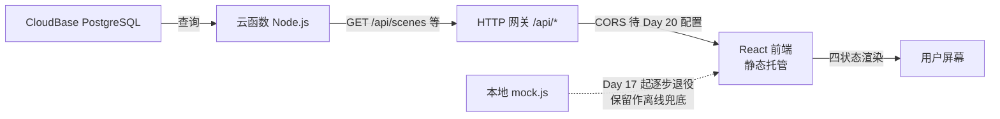

# 《电子设备使用指南》接口契约（api-contract）

> **v1.1 ｜ Day 16 产出** ｜ 2026-10-01 ｜ Vibe Coding 五步工作流 · 第 3 周第 2 天
>
> **本文档的依据**：`PRD.md` **v2.0** 第 6 节「数据字段」+ `TECH_DESIGN.md` **v2.0** 第 3 节「数据模型」+ **`db/schema.sql` 与 `db/seed.sql`（Day 16 定稿并已在 CloudBase 实际执行）** + `web/src/data/mock.js`（Day 15 程序化提取的真实数据）+ `cloudfunctions/health/README.md`（已上线口径）。
> **本文档的读者**：Day 17–19 写接口的我、Day 20 联调的我、第二期的我。
> **一句话总纲**：**契约先定，实现后填**——现在只有 `/api/health` 是真在跑的；数据库已建好且有真实数据，但**接口一个都没写**（除 health 外全是占位契约），Day 17 起逐个点亮。
>
> ⚠️ **诚实声明**：本文档中标注「**待定**」的条目是**尚未拍板的提案**，不是既成事实；标注「**已实现**」的条目有实测证据；标注「沿用」的条目直接沿用 PRD/TECH_DESIGN 的既有字段口径，未新增发明。
>
> 📌 **v1.1 核心变化**：第 3 节「数据模型」**从提案改为定稿**——字段名、类型、约束全部以 `db/schema.sql` 为准，与数据库**逐字段一致**（Day 16 已在控制台建表并灌入 72 行真实数据，行数经实测核对）。**契约与库不一致时，以本节为准去改库；库与本节约定的差异视为库需要迁移。**

---

## 1. 环境与基地址

| 项 | 值 | 状态 |
|---|---|---|
| CloudBase 环境名 | `wenwu-331122` | 已开通（体验版，到期 2027-03-31） |
| 环境 ID | `wenwu-331122-d6gyrwmum2a734671` | 已确认 |
| 云函数服务名 | `wenwu-vibecoding`（写入 `service` 字段） | 已定（Day 15 拍板） |
| **API 基地址**（云函数 / HTTP 网关） | `https://wenwu-331122-d6gyrwmum2a734671-1498887015.ap-shanghai.app.tcloudbase.com` | 已实测可用 |
| **前端访问地址**（静态托管） | `https://wenwu-331122-d6gyrwmum2a734671-1498877015.tcloudbaseapp.com/wenwu-vibecoding/` | 已实测可用 |
| 旧前端地址（GitHub Pages，保留） | `https://xingho-vibecoding.github.io/wenwu-vibecoding/` | 已上线 |

> **注意两个域名数字不一样**：`.tcloudbaseapp.com` 那段是静态托管（`...1498877015`），`.ap-shanghai.app.tcloudbase.com` 那段是云函数网关（`...1498887015`）。复制时别串。

**两处地址的关系**：

- 静态托管是**子路径部署**（域名后带 `/wenwu-vibecoding/`），不是根路径。Vite 配置 `base: "./"` 走相对路径，所以 assets 在子路径下正常加载（Day 15 已实测三个资源全 200）。
- 静态托管域名与云函数网关域名是**两个不同的域**（`tcloudbaseapp.com` vs `app.tcloudbase.com`）→ **前端调接口属于跨域请求**，浏览器会走 CORS 预检。**当前未配置 CORS**，这是 Day 20 的既定任务（附录 M 已注明"HTTP 访问服务 → CORS 就在这里配"）。

---

## 2. 通用约定

### 2.1 请求

| 约定项 | 口径 |
|---|---|
| 协议 | **仅 HTTPS**（两个域名都只提供 https） |
| 方法 | 读取类接口一律 `GET`；本期无写入类接口（无用户、无提交） |
| 路径风格 | 统一前缀 `/api/`；资源名用**复数小写**（`/api/scenes`），单个资源 `/{id}` 后缀 |
| 查询参数 | 小写下划线或小写单词（如 `?type=oscilloscope&q=触发`）；本期不引入分页参数（数据量 ≤ 34 条） |
| 请求体 | GET 请求不带 body |
| 字符集 | 一律 **UTF-8**，响应头须带 `charset=utf-8` |

### 2.2 响应

| 约定项 | 口径 |
|---|---|
| Content-Type | `application/json; charset=utf-8` |
| 成功形状 | `{"ok": true, ...业务字段}`（**沿用**已上线 `/api/health` 的形状，不另发明包裹层） |
| 失败形状 | `{"ok": false, "error": "<机器可读的错误标识>"}`（**沿用** `/api/health` 405 分支） |
| 状态码 | `200` 成功 / `400` 参数非法 / `404` 资源或路径不存在 / `405` 方法不允许 / `500` 服务端异常 |

### 2.3 关于"错误形状"的一处**待定**

当前 `/api/health` 的失败响应只有 `error` 一个字符串字段，没有错误码、没有中文提示。本期数据接口是否需要更结构化的错误（如 `{"ok":false,"error":"invalid_param","message":"type 取值非法"}`）→ **待 Day 17 拍板**。在拍板前，所有占位接口统一按上表的两字段形状写。

### 2.4 鉴权与限流

- **本期接口全部公开**，无鉴权、无 token、无账号体系（PRD 第 7 节：账号注册/登录不做）。
- 无接口级限流配置。**已知风险**：公开接口理论上可被刷——因接口只读、无写入、无敏感数据，风险可接受；如 Day 26 观察用量异常再议。

---

## 3. 数据模型（**Day 16 定稿，与数据库逐字段一致**）

> 本节字段**沿用** `PRD.md` 第 6 节与 `TECH_DESIGN.md` 第 3 节的字段口径，示例值**取自真实数据**（`db/seed.sql` 已入库的内容）。
> **命名已定稿**：mock 数据用的是**短键**（`t` / `k` / `steps` / `src` / `no` / `desc`），数据库统一改成**语义化字段名**，映射关系见各表「mock 短键」列与第 6 节速查表。

### 3.0 数据库交付物（Day 16 产出）

| 项 | 内容 |
|---|---|
| 建表脚本 | `db/schema.sql`（5 张表 + 主键 + 外键 + 约束 + 2 个索引 + 中文字段注释） |
| 种子脚本 | `db/seed.sql`（72 行真实数据；末尾附 2 条核对 SELECT） |
| 执行顺序 | **先 schema.sql，再 seed.sql**，都在「数据管理 → SQL 编辑器」整份粘贴执行 |
| 重复执行 | 两个脚本都可**反复整份执行**：schema 靠 `DROP TABLE IF EXISTS ... CASCADE`，seed 靠 `TRUNCATE ... RESTART IDENTITY CASCADE`。控制台会把这两类语句提示为「破坏性操作」——属预期，确认即可 |
| 实测行数（2026-10-01 控制台核对） | `scenes` 4 ／ `steps` 20 ／ `resources` 6 ／ `instruments` 34 ／ `tasks` 8 = **72 行** |
| 关联验证 | `scenes LEFT JOIN steps` 实测：S1–S4 各挂 **5** 步，外键 `steps.scene_id` 工作正常 |
| 字符编码 | 中文内容均正常显示，无乱码 |
| RLS | **未启用**（本期全用管理员身份在 SQL 编辑器操作，不受影响；云函数接库时的角色/RLS 问题 → Day 17 处理） |
| ⚠️ 安全边界 | 现在可随手 `DROP` / `TRUNCATE`，是因为**库里还没有不可重建的数据**。第二期一旦出现用户投稿等真实数据，`schema.sql` **不得再整份执行**，必须先导出备份 |

**Day 16 定稿的 5 处改名**（相对 v1.0 提案，原因是这些名字与 SQL 关键字或类型名撞车）：

| 原提案名 | 定稿名 | 为什么要改 |
|---|---|---|
| `desc` | `description` | `desc` 是 SQL 保留字（`ORDER BY x DESC`），直接当列名建表**语法报错** |
| `time` | `time_cost` | `time` 是 PostgreSQL 类型名，容易看混 |
| `text` | `content` | `text` 同为类型名，`text text NOT NULL` 读写别扭 |
| `use` | `purpose` | `use` 容易与 SQL 命令混 |
| `steps`（instruments 表的列） | `step_list` | 与表名 `steps` 撞车，`SELECT steps FROM instruments` 极难看懂 |

另有一处**收紧**：`scenes.prerequisite` 由 v1.0 的「可空」改为 **NOT NULL** —— PRD 的 AC-09 要求每个场景必须标前置条件，字段允许空等于允许交白卷。

### 3.1 `scenes` —— 场景（**4 条**，主表）

| 字段 | 类型 | 约束 | mock 短键 | 说明 |
|---|---|---|---|---|
| `id` | text | **主键** | `anchor` | `scene-1` … `scene-4`（沿用旧值，兼容已公开的地址） |
| `no` | text | **UNIQUE NOT NULL** | `no` | 显示编号 `S1` … `S4` |
| `name` | text | NOT NULL | `name` | 场景名，如 `实验数据 / 板书传电脑` |
| `method` | text | NOT NULL | `method` | 传法：`USB 数据线` / `LocalSend 局域网` / `网盘中转` / `云盘同步` |
| `description` | text | NOT NULL | `desc` | 一句话描述 ← **原提案名 `desc`** |
| `device_note` | text | NOT NULL DEFAULT `'Android + Windows'` | — | 适用设备/系统（本期固定值） |
| `prerequisite` | text | **NOT NULL** | — | 前置条件（v1.0 写「可空」，**Day 16 收紧**） |
| `step_count` | integer | NOT NULL DEFAULT 0，`CHECK >= 0` | `steps` | 步骤数（= 5）；mock 里 `steps` 是**数字**不是数组 |
| `difficulty` | text | NOT NULL DEFAULT `'待实测'` | `difficulty` | 现值为 `"待实测"` |
| `time_cost` | text | NOT NULL DEFAULT `'待实测'` | `time` | ← **原提案名 `time`** |
| `measure_status` | text | NOT NULL DEFAULT `'pending'`，`CHECK IN ('measured','pending')` | — | 难度/耗时是否已实测 |

**真实数据（4 条，已入库）**：S1 实验数据 / 板书传电脑（USB 数据线）· S2 电脑文件传回手机（LocalSend 局域网）· S3 大文件传输（网盘中转）· S4 资料两端同步（云盘同步）。**前置条件 4 条全部是真实内容**，例如 S1 的 `一根能传数据的 USB 数据线（很多线只能充电，不能传文件）`。

> **⚠️ 仍未还清的债（Day 16 如实记录）**：`difficulty` 与 `time_cost` **4 条全是 `"待实测"`**，`measure_status` 全为 `pending` → **AC-08（每步都有难度星级+耗时）仍未满足**。这是"宁缺不编"原则的诚实结果，不是遗漏，字段已按此设计（允许 NULL / 保留状态位），Day 17 起实测逐条补齐，**不得编数字**。

### 3.2 `steps` —— 步骤（**20 条** = 4 场景 × 5 步，子表）

| 字段 | 类型 | 约束 | 说明 |
|---|---|---|---|
| `id` | integer | **主键**（`GENERATED BY DEFAULT AS IDENTITY` 自增） | — |
| `scene_id` | text | **NOT NULL，外键 → `scenes(id)` ON DELETE CASCADE** | **子表与主表的关联字段**（今天要掌握的那一条） |
| `order_no` | integer | NOT NULL，`CHECK >= 1`，**UNIQUE(`scene_id`,`order_no`)** | 第几步；同一场景内不许重号 |
| `content` | text | NOT NULL | 步骤正文 ← **原提案名 `text`**；"一步只说一件事" |
| `difficulty_level` | integer | `CHECK BETWEEN 1 AND 5`，**可空** | 难度星级；未实测存 **NULL**（PG 的 CHECK 遇 NULL 视为通过，正好表达"未实测"） |
| `time_minutes` | integer | `CHECK >= 0`，**可空** | 预计耗时（分钟）；未实测存 **NULL** |
| `caution` | text | 可空 | 注意事项 / 常见的坑 |
| `measure_status` | text | NOT NULL DEFAULT `'pending'`，`CHECK IN ('measured','pending')` | 同 3.1 |

**索引**：`idx_steps_scene_id ON steps(scene_id)` —— PostgreSQL **不会**给外键自动建索引，手动补一个。

**真实数据（20 条，已入库）**：正文全部从根目录 `index.html` 第 544–686 行抽取（Day 6 手写内容），**一条没编**。`caution` 有值的只有 **4 条**：S1 第 1 步（数据线只能充电）、S2 第 2 步（AP 隔离）、S3 第 1 步（4GB 分卷压缩）、S4 第 5 步（同步盘不是备份）。其余 16 条为 NULL。

> **⚠️ 抽取时的一处有损处理（明确记录）**：原文 `index.html` 里的 `<b>` / `<code>` 强调标签**已剥离**，只保留纯文字 → 代价是原页面上「传输文件」「100%」这类加粗强调丢失。数据库不存 HTML 标签是刻意的；若日后要保留强调，需另加字段（本期不做）。
>
> **数据债**：`difficulty_level` 与 `time_minutes` **20 条全为 NULL**（未实测），对应 AC-08 未满足，同 3.1。
>
> **状态**：v1.0 时 `steps` 正文**只存在于 index.html 里**（React 版尚未做分步详情）——**Day 16 已完成抽取并入库**，此项欠账关闭。

### 3.3 `resources` —— 资源入口（**6 条**，独立表）

| 字段 | 类型 | 约束 | mock 短键 | 说明 |
|---|---|---|---|---|
| `id` | integer | **主键**（自增） | — | — |
| `name` | text | NOT NULL | `name` | 资源名，如 `Android 官方帮助` |
| `url` | text | NOT NULL，**`CHECK (url ~ '^https://')`** | `url` | 外链地址；从数据库层面拒绝 http |
| `purpose` | text | NOT NULL | `use` | 用途一句话 ← **原提案名 `use`**；不许写"官网"两个字应付（PRD F2 要求） |
| `kind` | text | NOT NULL，`CHECK IN ('official','community')` | — | 类型判定见下 |

**`kind` 的判定口径（Day 16 拍板）**：按**内容提供方**判 —— 厂商/平台官方内容 = `official`，第三方社区内容（论坛、个人博客）= `community`。

**真实数据（6 条，已入库）：全部 6 条均为 `official`** —— Android 官方帮助 / Microsoft Windows 支持 / LocalSend 官网 / 百度网盘官网 / OneDrive 帮助 / 坚果云帮助中心。`community` 本期为空（字段按第二期扩展位保留，**不为凑数硬塞社区内容**）→ 满足 AC-10「≥ 5 条」。

> **⚠️ 已知差异（Day 16 发现，只记录不擅改）**：`purpose` 的文案，**以 `index.html` 的完整版为准**入库，例如 Android 官方帮助那条是 `手机系统设置、USB 传输模式的官方说明，S1 第 1 步卡住先查这里`；而 `web/src/data/mock.js` 里是**截短版**（`…USB 传输模式官方说明`），且 mock.js 头部注释自称"与 index.html 完全一致"——**该注释不准确**。React 版前端目前显示的是截短版 → Day 17 接接口时会自然统一（前端改吃数据库），但**在此之前两版文案不一致是既成事实**，如实记录在此。

### 3.4 `instruments` —— 仪器操作条目（**34 条 / 6 台仪器**，独立表）

| 字段 | 类型 | 约束 | mock 短键 | 搜索角色 |
|---|---|---|---|---|
| `id` | integer | **主键**（自增） | — | — |
| `device_name` | text | NOT NULL | `t` | 仪器类型 + 型号，如 `示波器 GDS-1102B` | 展示用，**不参与匹配** |
| `title` | text | NOT NULL | `title` | 操作名一句话，如 `通断测试（查线路/焊点）` | **参与匹配** |
| `keywords` | text[] | NOT NULL | `k` | 触发关键词（含中文别名与英文小写） | **参与匹配**（逐词） |
| `step_list` | text[] | NOT NULL | `steps` | 分步清单，一步一条 ← **原提案名 `steps`，改名避开表名** | 展示用 |
| `source` | text | NOT NULL | `src` | 说明书名称 + PDF 实际页码，如 `操作手册 P48` | 展示用（回查出处） |
| `device_type` | text | NOT NULL，`CHECK IN (6 个枚举)` | — | 类型筛选（Day 12 的 `data-type`） | **Day 16 已成独立字段**，不再靠前端从 `t` 推导 |

**数量分布（真实统计，非估计）**：直流电源 GPS-2303C **5** / 万用表 GDM-8341 **7** / 示波器 GDS-1102B **8** / 信号发生器 AFG-2225 **5** / LCR 测试仪 LCR-6002 **3** / 晶体管图示仪 WQ4830 **6** = **34 条**（已按此分布入库核对）。

**`device_type` 取值（Day 16 **定稿**，数据库 `CHECK` 约束即此 6 值）**：

| 前端按钮 | 枚举值（定稿） | 条数 |
|---|---|---|
| 全部 | —（不传该参数 = 全部） | 34 |
| 直流电源 | `dc_power` | 5 |
| 万用表 | `multimeter` | 7 |
| 示波器 | `oscilloscope` | 8 |
| 信号发生器 | `signal_gen` | 5 |
| LCR 测试仪 | `lcr` | 3 |
| 图示仪 | `curve_tracer` | 6 |

> **前端待办（Day 17）**：前端 `data-type` 现用的是**中文标签**，需改成枚举值（或做映射）——数据库只认上面这 6 个英文值。

### 3.5 `tasks` —— 任务索引 / 跳转按钮（**8 条**，独立表）

| 字段 | 类型 | 约束 | mock 短键 | 说明 |
|---|---|---|---|---|
| `id` | integer | **主键**（自增） | — | — |
| `label` | text | NOT NULL | `label` | 显示名（场景名或别名），如 `拍板书` |
| `scene_id` | text | **NOT NULL，外键 → `scenes(id)` ON DELETE CASCADE** | `scene` | 跳转目标场景 |
| `keywords` | text[] | **可空（现全为 NULL）** | — | 搜索匹配关键词 |

**索引**：`idx_tasks_scene_id ON tasks(scene_id)`。

**真实数据（8 条，已入库）**：实验数据传电脑 / 拍板书（→ scene-1）、交作业 / 电脑文件传回手机（→ scene-2）、大文件传输 / 传安装包（→ scene-3）、资料两端同步 / 同步笔记（→ scene-4）→ 满足 AC-04「8 个按钮，每场景至少 2 条」。

> **`keywords` 为什么全存 NULL**：前端那 8 个关键词是**从 label 推导出来的，不是真实数据**——按"宁缺不编"，字段建好但值留空。以后真有了确定的搜索词再补。

---

## 4. 接口清单

### 4.1 ✅ 已实现：`GET /api/health`

**状态：已上线、已实测。** 本文档唯一有实测证据的接口。

**请求**

```
GET /api/health
Host: wenwu-331122-d6gyrwmum2a734671-1498887015.ap-shanghai.app.tcloudbase.com
```

无参数、无 body。

**成功响应（200）**

```json
{"ok": true, "service": "wenwu-vibecoding"}
```

响应头：`Content-Type: application/json; charset=utf-8`

**失败响应（405，非 GET 方法）**

```json
{"ok": false, "error": "method not allowed"}
```

**验证证据（2026-09-30）**

| 验证方式 | 结果 |
|---|---|
| 控制台「测试」直连 | 200 + `{"ok":true,"service":"wenwu-vibecoding"}` |
| 公网浏览器访问 | 200 + 同上 |
| 本机 Invoke-WebRequest 远程复核 | 200 / `application/json; charset=utf-8` |

**实现要点（详见 `cloudfunctions/health/README.md`）**

- Web 函数模式，`scf_bootstrap` 启动，`index.js` 用内置 `http` 模块**监听 9000 端口**（不是事件函数 + 集成响应）。
- 路由：控制台「HTTP 网关 → 域名及路由 → 路由管理」中配 `/api/health` → 云函数 `health`，**身份验证关闭**。
- ⚠️ 两条铁律（实测踩坑换来的）：① `package.json` **保持模板原样，永不替换**（改了必挂 `InvalidParameter.Dependency`）；② `index.js` 保持**纯 ASCII、零 `//` 注释**（控制台粘贴曾吃换行导致 `//` 吞掉后文）。
- 不连数据库、不写业务逻辑。

---

### 4.2 ⏳ 占位契约（Day 16–20 实现，**当前全部 404**）

以下接口**今天都不存在**，写了路径也是 404 `INVALID_PATH`。此处先定形状，Day 16 建表 / Day 17 起逐个点亮。

#### 4.2.1 `GET /api/scenes` —— 场景列表

**查询参数**：无

**响应（200）**

```json
{
  "ok": true,
  "count": 4,
  "items": [
    {
      "id": "scene-1",
      "no": "S1",
      "name": "实验数据 / 板书传电脑",
      "method": "USB 数据线",
      "description": "手机拍的实验数据、板书照片怎么进电脑、进报告。",
      "device_note": "Android + Windows",
      "prerequisite": "一根能传数据的 USB 数据线（很多线只能充电，不能传文件）",
      "step_count": 5,
      "difficulty": "待实测",
      "time_cost": "待实测",
      "measure_status": "pending"
    }
  ]
}
```

**失败**：`500 {"ok":false,"error":"internal_error"}`

> 字段名与取值**均取自数据库真实内容**（`scenes` 表第 1 行原样）。

#### 4.2.2 `GET /api/scenes/:id` —— 单个场景（含步骤）

**路径参数**：`id` = `scene-1` … `scene-4`

**响应（200）**

```json
{
  "ok": true,
  "item": {
    "id": "scene-1",
    "no": "S1",
    "name": "实验数据 / 板书传电脑",
    "method": "USB 数据线",
    "description": "手机拍的实验数据、板书照片怎么进电脑、进报告。",
    "device_note": "Android + Windows",
    "prerequisite": "一根能传数据的 USB 数据线（很多线只能充电，不能传文件）",
    "step_count": 5,
    "difficulty": "待实测",
    "time_cost": "待实测",
    "measure_status": "pending",
    "steps": [
      {
        "order_no": 1,
        "content": "用数据线连接手机与电脑。手机通知栏会弹出「USB 用途」提示——点开它，选择「传输文件」。不选的话，电脑那边只能看到手机在充电。",
        "difficulty_level": null,
        "time_minutes": null,
        "caution": "电脑完全没反应，九成是数据线只能充电——换一根再试；传文件期间保持手机亮屏解锁，锁屏后设备可能从电脑上消失。",
        "measure_status": "pending"
      }
    ]
  }
}
```

> 以上**全部是数据库真实内容**（`steps` 表 S1 第 1 步原样，含那条 `caution`）。`difficulty_level` / `time_minutes` 为 `null` 表示**未实测**，不是"忘了填"。
>
> **注意步骤正文的 HTML 已剥离**：原文是 `<b>「传输文件」</b>`，入库后是纯文字 `「传输文件」`。

**失败**

| 场景 | 状态码 | 响应 |
|---|---|---|
| id 不存在 | 404 | `{"ok":false,"error":"scene_not_found"}` |
| id 格式非法 | 400 | `{"ok":false,"error":"invalid_param"}` |

#### 4.2.3 `GET /api/resources` —— 资源入口列表

**查询参数**：无

**响应（200）**

```json
{
  "ok": true,
  "count": 6,
  "items": [
    {
      "id": 1,
      "name": "Android 官方帮助",
      "url": "https://support.google.com/android",
      "purpose": "手机系统设置、USB 传输模式的官方说明，S1 第 1 步卡住先查这里",
      "kind": "official"
    }
  ]
}
```

> `purpose` 是**完整文案**（取自 `index.html`），内容与数据库一致。6 条 `kind` 全为 `official`（口径见 3.3）。

#### 4.2.4 `GET /api/instruments` —— 仪器操作条目（搜索 + 类型筛选）

**查询参数**

| 参数 | 类型 | 必填 | 说明 |
|---|---|---|---|
| `q` | string | 否 | 关键词；对 `title` 与 `keywords` 做**包含匹配**（不区分大小写）。为空 = 不过滤 |
| `type` | string | 否 | `device_type` 枚举值（见 3.4 取值表）。不传 = 全部 |

**过滤顺序（沿用 Day 12 前端已实装的行为）**：**先按 `type` 取池子，再按 `q` 过滤**——两个条件是**交集**关系。

**响应（200）**

```json
{
  "ok": true,
  "count": 1,
  "items": [
    {
      "id": 14,
      "device_name": "万用表 GDM-8341",
      "device_type": "multimeter",
      "title": "通断测试（查线路/焊点）",
      "keywords": ["通断", "短路检查", "蜂鸣", "断线"],
      "step_list": [
        "按两次 Ω 键进入连续性测试",
        "表笔接 VΩ 和 COM，碰触被测线路两端",
        "导通时表发出蜂鸣并显示近似阻值——断电测"
      ],
      "source": "操作手册 P48"
    }
  ]
}
```

**空结果（200，不是 404）**

```json
{"ok": true, "count": 0, "items": []}
```

> **口径**：搜不到是**正常结果**，返回空数组 + 200，由前端渲染空态提示（对应 AC-14③"不是静默空白"）。**不要用 404 表达"没搜到"**。

**失败**

| 场景 | 状态码 | 响应 |
|---|---|---|
| `type` 取值不在枚举内 | 400 | `{"ok":false,"error":"invalid_param"}` |

#### 4.2.5 `GET /api/tasks` —— 任务索引（跳转按钮 + 搜索视图共用）

**查询参数**：无

**响应（200）**

```json
{
  "ok": true,
  "count": 8,
  "items": [
    { "id": 1, "label": "实验数据传电脑", "scene_id": "scene-1" },
    { "id": 2, "label": "拍板书", "scene_id": "scene-1" }
  ]
}
```

> 前端拿到 `scene_id` 后拼路由 `#/transfer/{scene_id}`（**沿用** TECH_DESIGN 第 3 节「路由目标」口径）。跳转本身仍由前端 hash 路由完成，接口只提供数据。

---

## 5. 前后端数据流（现状 → 目标）

### 5.1 现状（**Day 16 收工时**，三方仍未接通）

```
【已有】CloudBase PostgreSQL —— 5 张表 + 72 行真实数据 ✅
                │
                │  ✗ 没有人连它（云函数里没有一行数据库代码）
                ▼
【半成品】云函数 wenwu-vibecoding —— 只有 /api/health，不碰数据库 ⚠️
                │
                │  ✗ 前端根本没发请求
                ▼
【前端】React 静态托管版 —— 数据仍来自本地 mock.js，零网络请求 ⚠️
```

- **⚠️ 必须记住的诚实结论**：库、云函数、前端**三层各自存在，但没有一层接通下一层**。前端的 `mock.js` 与数据库内容**内容相同、来源无关**——不是"从库里读出来的"。
- 前端**零网络请求**：搜索、筛选、渲染全部在浏览器本地完成（唯一线上接口 `/api/health` 未被前端调用）。
- 打包产物路径：`web/dist/` → 上传 CloudBase 静态托管 → 公网子路径 `/wenwu-vibecoding/`。
- 静态站版（根 `index.html`）与 React 版**都还在跑**，两版并存（判卷标准分两套，不混用）。

### 5.2 目标（Day 16–20，接后端）



**切换步骤（Day 17–20，逐接口替换，不一次性大改）**

1. 前端新增统一的 `fetch` 封装（含错误捕获 → 四状态里「错误态」的触发源）。
2. 按接口逐个把 mock 常量换成 `fetch`：`scenes` → `steps` → `resources` → `instruments` → `tasks`。
3. 每换一个，验证 AC-13 / AC-15 的**加载中 / 成功 / 空 / 错误**四状态仍然成立（四状态是 Day 8 起就有的差异点，不能被换后端换丢了）。
4. 全部换完后，`mock.js` 保留为**离线兜底**（本地开发用），不删。

**⚠️ 尚未解决的前置问题（Day 20 必做）**：静态托管域与云函数域不同源 → **必须配 CORS**，否则浏览器预检直接失败，前端全部接口调用报错。这是 Day 15 部署完成后**新暴露出来的问题**，附录 M 已把它排给 Day 20。

---

## 6. mock.js 字段 → 接口/数据库字段映射速查（Day 16 更新）

Day 17 改造前端时按此表改，避免漏字段。**右侧是数据库真实列名**（与接口返回字段一致）：

| mock 文件/常量 | mock 键 | 接口字段 = 数据库列 | 接口 |
|---|---|---|---|
| `MOCK.scenes[].anchor` | `anchor` | `id` | /api/scenes |
| `MOCK.scenes[].no` | `no` | `no` | /api/scenes |
| `MOCK.scenes[].name` | `name` | `name` | /api/scenes |
| `MOCK.scenes[].method` | `method` | `method` | /api/scenes |
| `MOCK.scenes[].desc` | `desc` | **`description`** | /api/scenes |
| `MOCK.scenes[].steps` | `steps` | `step_count`（**语义变化**：都是数字，但数据库里是"计数"，不是数组） | /api/scenes |
| `MOCK.scenes[].difficulty` | `difficulty` | `difficulty` | /api/scenes |
| `MOCK.scenes[].time` | `time` | **`time_cost`** | /api/scenes |
| （mock 无此字段） | — | `prerequisite`（**数据库必填**）、`measure_status`、`device_note` | /api/scenes |
| `MOCK.resources[].name/url` | 同名 | 同名 | /api/resources |
| `MOCK.resources[].use` | `use` | **`purpose`** | /api/resources |
| `INSTRUMENT_OPS[].t` | `t` | `device_name` | /api/instruments |
| `INSTRUMENT_OPS[].title` | `title` | `title` | /api/instruments |
| `INSTRUMENT_OPS[].k` | `k` | `keywords` | /api/instruments |
| `INSTRUMENT_OPS[].steps` | `steps` | **`step_list`** | /api/instruments |
| `INSTRUMENT_OPS[].src` | `src` | `source` | /api/instruments |
| （前端从 `t` 推导） | — | `device_type`（**已成独立列**，6 个英文枚举） | /api/instruments |
| `TASK_INDEX[].label` | `label` | `label` | /api/tasks |
| `TASK_INDEX[].scene` | `scene` | `scene_id` | /api/tasks |
| （前端推导） | — | `keywords`（**数据库存 NULL**） | /api/tasks |

**⚠️ 四处改名 + 一处语义变化**，Day 17 改前端时最容易踩：`desc→description`、`time→time_cost`、`use→purpose`、`steps(instruments)→step_list`；以及 `scenes.steps` 这个 mock 短键对应的数字，含义是**步骤计数**（`step_count`），不是步骤数组。

---

## 7. 待定与欠账（**Day 16 收工时的真实状态**）

### 7.1 已关闭（Day 16 做完）

| # | 事项 | 结果 |
|---|---|---|
| 1 | 建表 | ✅ 5 张表已在 CloudBase 实际建成（列数经控制台核对） |
| 2 | `steps` 正文未结构化 | ✅ 已从 `index.html` 抽取 **20 条**并入库 |
| 3 | `resources.kind` 字段不存在 | ✅ 已建，6 条全判为 `official`（口径见 3.3） |
| 4 | `instruments.device_type` 靠前端推导 | ✅ 已成独立列 + `CHECK` 枚举，34 条逐条落值 |
| 5 | `scenes.prerequisite` 缺失 | ✅ 4 条真实前置条件已入库，字段收紧为 NOT NULL |
| 6 | 5 处字段名与 SQL 关键字/类型名撞车 | ✅ 已改名（第 3.0 节），契约与库一致 |

### 7.2 未关闭（**别当成已解决**）

| # | 事项 | 影响 | 归属 |
|---|---|---|---|
| 1 | `difficulty` / `time_cost` / `difficulty_level` / `time_minutes` **全部未实测**（`measure_status` 全为 `pending`） | **AC-08 仍未满足** | 需实测后逐条 UPDATE，**不得编数字** |
| 2 | 错误响应是否要加错误码 / 中文提示 | 前端错误态文案质量 | Day 17 拍板 |
| 3 | **CORS 未配置**（静态托管域 ≠ 云函数域，跨域预检必失败） | 前端接接口**必然报错**，且容易被误诊成"fetch 写错了" | Day 20（附录 M 已排） |
| 4 | 是否保留 `mock.js` 作离线兜底 | 断网可用性（AC-03/AC-14④） | Day 17 起定 |
| 5 | React 版前端显示的资源文案是**截短版**，与库/静态站不一致 | 两版内容不一致 | Day 17 接接口后自然统一 |
| 6 | 前端 `data-type` 用**中文标签**，库用 6 个英文枚举 | 筛选会失灵 | Day 17 改前端 |
| 7 | 云函数连库的**角色与 RLS** 未定（当前 RLS 全部未启用） | 接口能否读到数据 | Day 17 |

---

## 8. 修订记录

| 版本 | 日期 | 变更 |
|---|---|---|
| v1.0 | 2026-09-30 | 初稿（Day 15 板块④产出）。定基地址与通用约定；确立 5 张表字段口径（`scenes` / `steps` / `resources` / `instruments` / `tasks`）；`GET /api/health` 记为已实现（附三方验证证据）；其余 5 个接口列为占位契约；附 mock 字段映射表与 7 项待定欠账。**引擎注**：`scenes` 数据债（难度/耗时全"待实测"）与 CORS 未配置为本次排查新发现，非沿用旧口径。 |
| **v1.1** | **2026-10-01** | **Day 16 建表回写（本文档与数据库逐字段对齐）**：① 新增 **3.0 数据库交付物**（`db/schema.sql` / `db/seed.sql`、执行顺序、可重复执行机制、实测行数 4/20/6/34/8=72、关联验证、RLS 未启用、安全边界）；② 第 3 节五张表**从提案改为定稿**，字段名/类型/约束/索引全部按 `db/schema.sql` 重写，示例值换成数据库真实内容；③ **5 处改名定稿**：`desc→description`、`time→time_cost`、`text→content`、`use→purpose`、`instruments.steps→step_list`；④ `prerequisite` 可空 → **NOT NULL**；⑤ `device_type` 枚举**定稿**并补每类条数；⑥ 第 4 节各接口响应示例改用真实字段名与真实数据（`/api/scenes`、`/api/scenes/:id`、`/api/resources`、`/api/instruments`）；⑦ 第 6 节映射表更新为「mock 键 → 数据库列名」；⑧ 第 7 节拆成「已关闭 6 项 / 未关闭 7 项」，如实记录 AC-08 仍未满足、CORS 未配、RLS 未定。**引擎注**：v1.0 中「其余 5 个接口」仍**全部为占位契约、当前调用全是 404**——Day 16 只建了库，**没写任何接口**。 |
