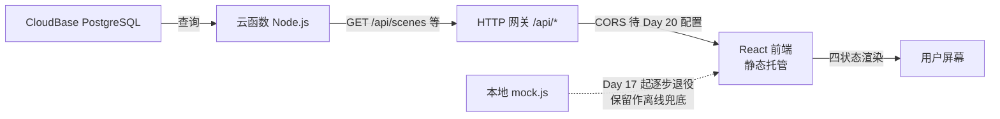

# 《电子设备使用指南》接口契约（api-contract）

> **Day 15 产出** ｜ 2026-09-30 ｜ Vibe Coding 五步工作流 · 第 3 周第 1 天
>
> **本文档的依据**：`PRD.md` **v2.0** 第 6 节「数据字段」+ `TECH_DESIGN.md` **v2.0** 第 3 节「数据模型」+ `web/src/data/mock.js`（Day 15 程序化提取的真实数据）+ `cloudfunctions/health/README.md`（已上线口径）。
> **本文档的读者**：Day 16 建表的我、Day 17–19 写接口的我、Day 20 联调的我。
> **一句话总纲**：**契约先定，实现后填**——今天只有 `/api/health` 是真在跑的，其余全部是**占位契约**，等 Day 16 建表、Day 17 起逐个点亮。
>
> ⚠️ **诚实声明**：本文档中标注「**待定**」的条目是**尚未拍板的提案**，不是既成事实；标注「**已实现**」的条目有实测证据；标注「沿用」的条目直接沿用 PRD/TECH_DESIGN 的既有字段口径，未新增发明。

---

## 1. 环境与基地址

| 项 | 值 | 状态 |
|---|---|---|
| CloudBase 环境名 | `wenwu-331122` | 已开通（体验版，到期 2027-03-31） |
| 环境 ID | `wenwu-331122-d6gyrwmum2a734671` | 已确认 |
| 云函数服务名 | `wenwu-vibecoding`（写入 `service` 字段） | 已定（Day 15 拍板） |
| **API 基地址**（云函数 / HTTP 网关） | `https://wenwu-331122-d6gyrwmum2a734671-1498887015.ap-shanghai.app.tcloudbase.com` | 已实测可用 |
| **前端访问地址**（静态托管） | `https://wenwu-331122-d6gyrwmum2a734671-1498877015.tcloudbaseapp.com/wenwu-vibecoding/` | 已实测可用 |
| 旧前端地址（GitHub Pages，保留） | `https://xingho-vibecoding.github.io/wenwu-vibecoding/` | 已上线 |

> **注意两个域名数字不一样**：`.tcloudbaseapp.com` 那段是静态托管（`...1498877015`），`.ap-shanghai.app.tcloudbase.com` 那段是云函数网关（`...1498887015`）。复制时别串。

**两处地址的关系**：

- 静态托管是**子路径部署**（域名后带 `/wenwu-vibecoding/`），不是根路径。Vite 配置 `base: "./"` 走相对路径，所以 assets 在子路径下正常加载（Day 15 已实测三个资源全 200）。
- 静态托管域名与云函数网关域名是**两个不同的域**（`tcloudbaseapp.com` vs `app.tcloudbase.com`）→ **前端调接口属于跨域请求**，浏览器会走 CORS 预检。**当前未配置 CORS**，这是 Day 20 的既定任务（附录 M 已注明"HTTP 访问服务 → CORS 就在这里配"）。

---

## 2. 通用约定

### 2.1 请求

| 约定项 | 口径 |
|---|---|
| 协议 | **仅 HTTPS**（两个域名都只提供 https） |
| 方法 | 读取类接口一律 `GET`；本期无写入类接口（无用户、无提交） |
| 路径风格 | 统一前缀 `/api/`；资源名用**复数小写**（`/api/scenes`），单个资源 `/{id}` 后缀 |
| 查询参数 | 小写下划线或小写单词（如 `?type=oscilloscope&q=触发`）；本期不引入分页参数（数据量 ≤ 34 条） |
| 请求体 | GET 请求不带 body |
| 字符集 | 一律 **UTF-8**，响应头须带 `charset=utf-8` |

### 2.2 响应

| 约定项 | 口径 |
|---|---|
| Content-Type | `application/json; charset=utf-8` |
| 成功形状 | `{"ok": true, ...业务字段}`（**沿用**已上线 `/api/health` 的形状，不另发明包裹层） |
| 失败形状 | `{"ok": false, "error": "<机器可读的错误标识>"}`（**沿用** `/api/health` 405 分支） |
| 状态码 | `200` 成功 / `400` 参数非法 / `404` 资源或路径不存在 / `405` 方法不允许 / `500` 服务端异常 |

### 2.3 关于"错误形状"的一处**待定**

当前 `/api/health` 的失败响应只有 `error` 一个字符串字段，没有错误码、没有中文提示。本期数据接口是否需要更结构化的错误（如 `{"ok":false,"error":"invalid_param","message":"type 取值非法"}`）→ **待 Day 17 拍板**。在拍板前，所有占位接口统一按上表的两字段形状写。

### 2.4 鉴权与限流

- **本期接口全部公开**，无鉴权、无 token、无账号体系（PRD 第 7 节：账号注册/登录不做）。
- 无接口级限流配置。**已知风险**：公开接口理论上可被刷——因接口只读、无写入、无敏感数据，风险可接受；如 Day 26 观察用量异常再议。

---

## 3. 数据模型（表设计依据）

> 本节字段**沿用** `PRD.md` 第 6 节与 `TECH_DESIGN.md` 第 3 节，示例值**取自** `web/src/data/mock.js` 的真实数据（Day 15 程序化提取，未手工改写）。
> **命名提醒**：现有 mock 数据用的是**短键**（`t` / `k` / `steps` / `src` / `no` / `desc`）；建表时建议改成**语义化字段名**，映射关系见本节各表的「mock 短键」列。这条是 Day 15 的**提案**，Day 16 建表时最终定。

### 3.1 `scenes` —— 场景（4 条）

| 字段 | 类型 | 约束 | mock 短键 | 说明 |
|---|---|---|---|---|
| `id` | string | 主键 | `anchor` | `scene-1` … `scene-4`（**沿用**，公开地址兼容用） |
| `no` | string | 唯一 | `no` | 显示编号 `S1` … `S4` |
| `name` | string | 非空 | `name` | 场景名，如 `实验数据 / 板书传电脑` |
| `method` | string | 非空 | `method` | 本场景用的传法，如 `USB 数据线` / `LocalSend 局域网` / `网盘中转` / `云盘同步` |
| `desc` | string | 非空 | `desc` | 一句话描述（PRD 第 6 节「一句话描述」） |
| `device_note` | string | 默认 `Android + Windows` | — | 适用设备/系统标注（PRD 第 6 节，本期固定值） |
| `prerequisite` | string | 可空 | — | 前置条件（PRD 第 6 节 / AC-09 要求必填 → **Day 16 补**，现 mock 数据中缺此字段） |
| `step_count` | int | ≥ 0 | `steps` | 步骤数；**注意 mock 里 `steps` 是数字（如 `5`），不是步骤数组** |
| `difficulty` | string | — | `difficulty` | 现值为 `"待实测"` |
| `time` | string | — | `time` | 现值为 `"待实测"` |
| `measure_status` | string | `measured` / `pending` | — | **提案新增**：难度与耗时是否已实测。PRD 第 8.3 条要求"宁缺不编"且保留实测状态 → 建表时必须能区分 |

> **⚠️ 数据债（Day 15 发现，Day 16 必须处理）**：`scenes` 4 条里 `difficulty` 与 `time` **全是 `"待实测"`**，且缺 `prerequisite`。这是"宁缺不编"原则的诚实结果，不是遗漏——但它意味着 **AC-08（每步都有难度星级+耗时）与 AC-09（每场景标注前置条件）目前尚未满足**，Day 16–19 做真实数据时必须逐条实测补齐，不能直接搬进数据库。

### 3.2 `steps` —— 步骤（每条场景 5 步）

| 字段 | 类型 | 约束 | 说明 |
|---|---|---|---|
| `id` | int / uuid | 主键 | — |
| `scene_id` | string | 外键 → `scenes.id` | `scene-1` … |
| `order_no` | int | ≥ 1，场景内唯一 | 第几步 |
| `text` | string | 非空 | 步骤描述，"一步只说一件事"（PRD 第 6 节） |
| `difficulty_level` | int | 1–5 或 null | 难度星级；未实测填 null |
| `time_minutes` | int | ≥ 0 或 null | 预计耗时（分钟）；未实测填 null |
| `caution` | string | 可空 | 注意事项 / 常见的坑（**可选**字段） |
| `measure_status` | string | `measured` / `pending` | 同 3.1，**提案新增** |

> **现状**：`steps` 表的数据**目前只存在于根目录 `index.html` 的 S1–S4 正文里**（Day 6 手写）。`web/src/data/mock.js` 只搬了场景摘要（`step_count`），**没有搬步骤正文** —— React 版尚未做分步详情（Day 15 范围声明里已列明）。→ **Day 16 建表时这项工作必须一并做**（从 index.html 抽步骤正文）。

### 3.3 `resources` —— 资源入口（6 条）

| 字段 | 类型 | 约束 | mock 短键 | 说明 |
|---|---|---|---|---|
| `id` | int | 主键 | — | — |
| `name` | string | 非空 | `name` | 资源名，如 `Android 官方帮助` |
| `url` | string | 非空，https | `url` | 外链地址，新标签页打开（F2） |
| `use` | string | 非空 | `use` | 用途一句话，**不许写"官网"两个字应付**（PRD F2 内容要求） |
| `kind` | string | `official` / `community` | — | 类型（PRD 第 6 节「类型（官方或社区）」）→ **现 mock 数据中缺此字段，Day 16 补** |

真实数据（6 条，取自 `mock.js`）：Android 官方帮助 / Microsoft Windows 支持 / LocalSend 官网 / 百度网盘官网 / OneDrive 帮助 / 坚果云帮助中心 → 满足 AC-10「≥ 5 条」。按上表 `kind` 口径，前两条为 `official`，后四条中的工具官网 → **Day 16 逐条判定**。

### 3.4 `instruments` —— 仪器操作条目（34 条 / 6 台仪器）

| 字段 | 类型 | 约束 | mock 短键 | 搜索角色 |
|---|---|---|---|---|
| `id` | int | 主键 | — | — |
| `device_name` | string | 非空 | `t` | 仪器类型 + 型号，如 `示波器 GDS-1102B` | 展示用，**不参与匹配** |
| `title` | string | 非空 | `title` | 操作名一句话，如 `通断测试（查线路/焊点）` | **参与匹配** |
| `keywords` | string[] | 非空 | `k` | 触发关键词（含中文别名与英文小写） | **参与匹配**（逐词） |
| `steps` | string[] | 非空 | `steps` | 分步清单，一步一条 | 展示用 |
| `source` | string | 非空 | `src` | 说明书名称 + PDF 实际页码，如 `操作手册 P48` | 展示用（回查出处） |
| `device_type` | string | 见下取值表 | — | 类型筛选用（Day 12 的 `data-type`）→ **现 mock 数据中无此字段（靠前端从 `t` 字符串推），Day 16 建表时落成独立字段** |

**数量分布（真实统计，非估计）**：直流电源 GPS-2303C 5 条 / 万用表 GDM-8341 7 条 / 示波器 GDS-1102B 8 条 / 信号源 AFG-2225 5 条 / LCR-6002 3 条 / 图示仪 WQ4830 6 条 = **34 条**。

**`device_type` 取值（Day 12 前端已用 7 个筛选按钮，映射为英文枚举）**：

| 前端按钮 | 建议枚举值 |
|---|---|
| 全部 | —（不传该参数 = 全部） |
| 直流电源 | `dc_power` |
| 万用表 | `multimeter` |
| 示波器 | `oscilloscope` |
| 信号发生器 | `signal_gen` |
| LCR 测试仪 | `lcr` |
| 图示仪 | `curve_tracer` |

> 枚举值为 **Day 15 提案**，Day 16 建表时定稿。前端 `data-type` 现用的中文标签需同步改成枚举值（或做映射）。

### 3.5 `tasks` —— 任务索引 / 跳转按钮（8 条）

| 字段 | 类型 | 约束 | mock 短键 | 说明 |
|---|---|---|---|---|
| `id` | int | 主键 | — | — |
| `label` | string | 非空 | `label` | 显示名（场景名或别名），如 `拍板书` |
| `scene_id` | string | 外键 → `scenes.id` | `scene` | 跳转目标场景 |
| `keywords` | string[] | 可空 | — | 搜索匹配关键词（**沿用** TECH_DESIGN 第 3 节「匹配关键词」口径，现由前端推导） |

**真实数据（8 条）**：实验数据传电脑 / 拍板书（→ scene-1）、交作业 / 电脑文件传回手机（→ scene-2）、大文件传输 / 传安装包（→ scene-3）、资料两端同步 / 同步笔记（→ scene-4）→ 满足 AC-04「8 个按钮，每场景至少 2 条」。

---

## 4. 接口清单

### 4.1 ✅ 已实现：`GET /api/health`

**状态：已上线、已实测。** 本文档唯一有实测证据的接口。

**请求**

```
GET /api/health
Host: wenwu-331122-d6gyrwmum2a734671-1498887015.ap-shanghai.app.tcloudbase.com
```

无参数、无 body。

**成功响应（200）**

```json
{"ok": true, "service": "wenwu-vibecoding"}
```

响应头：`Content-Type: application/json; charset=utf-8`

**失败响应（405，非 GET 方法）**

```json
{"ok": false, "error": "method not allowed"}
```

**验证证据（2026-09-30）**

| 验证方式 | 结果 |
|---|---|
| 控制台「测试」直连 | 200 + `{"ok":true,"service":"wenwu-vibecoding"}` |
| 公网浏览器访问 | 200 + 同上 |
| 本机 Invoke-WebRequest 远程复核 | 200 / `application/json; charset=utf-8` |

**实现要点（详见 `cloudfunctions/health/README.md`）**

- Web 函数模式，`scf_bootstrap` 启动，`index.js` 用内置 `http` 模块**监听 9000 端口**（不是事件函数 + 集成响应）。
- 路由：控制台「HTTP 网关 → 域名及路由 → 路由管理」中配 `/api/health` → 云函数 `health`，**身份验证关闭**。
- ⚠️ 两条铁律（实测踩坑换来的）：① `package.json` **保持模板原样，永不替换**（改了必挂 `InvalidParameter.Dependency`）；② `index.js` 保持**纯 ASCII、零 `//` 注释**（控制台粘贴曾吃换行导致 `//` 吞掉后文）。
- 不连数据库、不写业务逻辑。

---

### 4.2 ⏳ 占位契约（Day 16–20 实现，**当前全部 404**）

以下接口**今天都不存在**，写了路径也是 404 `INVALID_PATH`。此处先定形状，Day 16 建表 / Day 17 起逐个点亮。

#### 4.2.1 `GET /api/scenes` —— 场景列表

**查询参数**：无

**响应（200）**

```json
{
  "ok": true,
  "count": 4,
  "items": [
    {
      "id": "scene-1",
      "no": "S1",
      "name": "实验数据 / 板书传电脑",
      "method": "USB 数据线",
      "desc": "手机拍的实验数据、板书照片怎么进电脑、进报告。",
      "device_note": "Android + Windows",
      "prerequisite": "USB 数据线一根",
      "step_count": 5,
      "difficulty": "待实测",
      "time": "待实测",
      "measure_status": "pending"
    }
  ]
}
```

**失败**：`500 {"ok":false,"error":"internal_error"}`

> 字段示例中 `prerequisite` 的值是**示意**（Day 16 实测后填真实内容），其余字段值均取自真实数据。

#### 4.2.2 `GET /api/scenes/:id` —— 单个场景（含步骤）

**路径参数**：`id` = `scene-1` … `scene-4`

**响应（200）**

```json
{
  "ok": true,
  "item": {
    "id": "scene-1",
    "no": "S1",
    "name": "实验数据 / 板书传电脑",
    "method": "USB 数据线",
    "desc": "手机拍的实验数据、板书照片怎么进电脑、进报告。",
    "device_note": "Android + Windows",
    "prerequisite": "USB 数据线一根",
    "step_count": 5,
    "difficulty": "待实测",
    "time": "待实测",
    "measure_status": "pending",
    "steps": [
      {
        "order_no": 1,
        "text": "用数据线把手机连到电脑，手机下拉通知栏把 USB 用途改成「传输文件 / MTP」",
        "difficulty_level": null,
        "time_minutes": null,
        "caution": null,
        "measure_status": "pending"
      }
    ]
  }
}
```

> ⚠️ `steps[0].text` 这一条是**示意文本**，用来展示字段形状；真实步骤正文在根目录 `index.html` 的 S1–S4 里，Day 16 抽取后替换。

**失败**

| 场景 | 状态码 | 响应 |
|---|---|---|
| id 不存在 | 404 | `{"ok":false,"error":"scene_not_found"}` |
| id 格式非法 | 400 | `{"ok":false,"error":"invalid_param"}` |

#### 4.2.3 `GET /api/resources` —— 资源入口列表

**查询参数**：无

**响应（200）**

```json
{
  "ok": true,
  "count": 6,
  "items": [
    {
      "id": 1,
      "name": "Android 官方帮助",
      "url": "https://support.google.com/android",
      "use": "手机系统设置、USB 传输模式官方说明",
      "kind": "official"
    }
  ]
}
```

#### 4.2.4 `GET /api/instruments` —— 仪器操作条目（搜索 + 类型筛选）

**查询参数**

| 参数 | 类型 | 必填 | 说明 |
|---|---|---|---|
| `q` | string | 否 | 关键词；对 `title` 与 `keywords` 做**包含匹配**（不区分大小写）。为空 = 不过滤 |
| `type` | string | 否 | `device_type` 枚举值（见 3.4 取值表）。不传 = 全部 |

**过滤顺序（沿用 Day 12 前端已实装的行为）**：**先按 `type` 取池子，再按 `q` 过滤**——两个条件是**交集**关系。

**响应（200）**

```json
{
  "ok": true,
  "count": 1,
  "items": [
    {
      "id": 14,
      "device_name": "万用表 GDM-8341",
      "device_type": "multimeter",
      "title": "通断测试（查线路/焊点）",
      "keywords": ["通断", "短路检查", "蜂鸣", "断线"],
      "steps": [
        "按两次 Ω 键进入连续性测试",
        "表笔接 VΩ 和 COM，碰触被测线路两端",
        "导通时表发出蜂鸣并显示近似阻值——断电测"
      ],
      "source": "操作手册 P48"
    }
  ]
}
```

**空结果（200，不是 404）**

```json
{"ok": true, "count": 0, "items": []}
```

> **口径**：搜不到是**正常结果**，返回空数组 + 200，由前端渲染空态提示（对应 AC-14③"不是静默空白"）。**不要用 404 表达"没搜到"**。

**失败**

| 场景 | 状态码 | 响应 |
|---|---|---|
| `type` 取值不在枚举内 | 400 | `{"ok":false,"error":"invalid_param"}` |

#### 4.2.5 `GET /api/tasks` —— 任务索引（跳转按钮 + 搜索视图共用）

**查询参数**：无

**响应（200）**

```json
{
  "ok": true,
  "count": 8,
  "items": [
    { "id": 1, "label": "实验数据传电脑", "scene_id": "scene-1" },
    { "id": 2, "label": "拍板书", "scene_id": "scene-1" }
  ]
}
```

> 前端拿到 `scene_id` 后拼路由 `#/transfer/{scene_id}`（**沿用** TECH_DESIGN 第 3 节「路由目标」口径）。跳转本身仍由前端 hash 路由完成，接口只提供数据。

---

## 5. 前后端数据流（现状 → 目标）

### 5.1 现状（Day 15，mock 版）

```
web/src/data/mock.js（本地常量，随 JS 打包进浏览器）
        │  import
        ▼
React 组件（SearchView / TransferView / DeviceView）
        │  本地过滤
        ▼
用户屏幕
（唯一线上接口 /api/health 未被前端调用，仅作连通性验证）
```

- 前端**零网络请求**：搜索、筛选、渲染全部在浏览器本地完成。
- 打包产物路径：`web/dist/` → 上传 CloudBase 静态托管 → 公网子路径 `/wenwu-vibecoding/`。

### 5.2 目标（Day 16–20，接后端）



**切换步骤（Day 17–20，逐接口替换，不一次性大改）**

1. 前端新增统一的 `fetch` 封装（含错误捕获 → 四状态里「错误态」的触发源）。
2. 按接口逐个把 mock 常量换成 `fetch`：`scenes` → `steps` → `resources` → `instruments` → `tasks`。
3. 每换一个，验证 AC-13 / AC-15 的**加载中 / 成功 / 空 / 错误**四状态仍然成立（四状态是 Day 8 起就有的差异点，不能被换后端换丢了）。
4. 全部换完后，`mock.js` 保留为**离线兜底**（本地开发用），不删。

**⚠️ 尚未解决的前置问题（Day 20 必做）**：静态托管域与云函数域不同源 → **必须配 CORS**，否则浏览器预检直接失败，前端全部接口调用报错。这是 Day 15 部署完成后**新暴露出来的问题**，附录 M 已把它排给 Day 20。

---

## 6. mock.js 字段 → 接口字段映射速查

Day 17 改造前端时按此表改，避免漏字段：

| mock 文件/常量 | mock 键 | 接口字段 | 接口 |
|---|---|---|---|
| `MOCK.scenes[].anchor` | `anchor` | `id` | /api/scenes |
| `MOCK.scenes[].no` | `no` | `no` | /api/scenes |
| `MOCK.scenes[].name` | `name` | `name` | /api/scenes |
| `MOCK.scenes[].method` | `method` | `method` | /api/scenes |
| `MOCK.scenes[].desc` | `desc` | `desc` | /api/scenes |
| `MOCK.scenes[].steps` | `steps` | `step_count`（**注意语义变化**：数字 → 数字，但不是数组） | /api/scenes |
| `MOCK.scenes[].difficulty` | `difficulty` | `difficulty` | /api/scenes |
| `MOCK.scenes[].time` | `time` | `time` | /api/scenes |
| `MOCK.resources[].name/url/use` | 同名 | 同名 | /api/resources |
| `INSTRUMENT_OPS[].t` | `t` | `device_name` | /api/instruments |
| `INSTRUMENT_OPS[].title` | `title` | `title` | /api/instruments |
| `INSTRUMENT_OPS[].k` | `k` | `keywords` | /api/instruments |
| `INSTRUMENT_OPS[].steps` | `steps` | `steps` | /api/instruments |
| `INSTRUMENT_OPS[].src` | `src` | `source` | /api/instruments |
| （前端从 `t` 推导） | — | `device_type` | /api/instruments |
| `TASK_INDEX[].label` | `label` | `label` | /api/tasks |
| `TASK_INDEX[].scene` | `scene` | `scene_id` | /api/tasks |

---

## 7. 待定与欠账（Day 16 开工前必须过一遍）

| # | 事项 | 影响 | 归属 |
|---|---|---|---|
| 1 | `scenes.difficulty` / `time` **4 条全是"待实测"**，`prerequisite` 缺失 | AC-08 / AC-09 未满足 | Day 16–19 逐条实测补齐 |
| 2 | `steps` 正文仍只在根目录 `index.html` 里，未结构化 | 步骤接口无数据可返回 | Day 16 抽取 |
| 3 | `resources.kind`（官方/社区）字段不存在 | PRD 第 6 节字段不完整 | Day 16 逐条判定补 |
| 4 | `instruments.device_type` 靠前端字符串推导，未独立成字段 | 类型筛选接口无法按枚举过滤 | Day 16 建表时落字段 |
| 5 | 错误响应是否要加错误码 / 中文提示 | 前端错误态文案质量 | Day 17 拍板 |
| 6 | **CORS 未配置**（跨域预检必失败） | 前端接接口**必然报错** | Day 20 |
| 7 | 是否保留 `mock.js` 作离线兜底 | 断网可用性（AC-03/AC-14④） | Day 17 起定 |

---

## 8. 修订记录

| 版本 | 日期 | 变更 |
|---|---|---|
| v1.0 | 2026-09-30 | 初稿（Day 15 板块④产出）。定基地址与通用约定；确立 5 张表字段口径（`scenes` / `steps` / `resources` / `instruments` / `tasks`）；`GET /api/health` 记为已实现（附三方验证证据）；其余 5 个接口列为占位契约；附 mock 字段映射表与 7 项待定欠账。**引擎注**：`scenes` 数据债（难度/耗时全"待实测"）与 CORS 未配置为本次排查新发现，非沿用旧口径。 |
